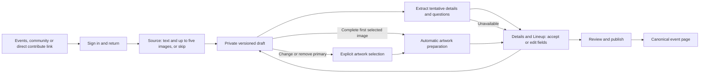

# Event intake sources and model controls

The backend operations and authenticated adapters share one private intake contract.
Website and MCP callers must never supply actor identity in request JSON.

## Upload and artwork boundaries

`createEventPosterHandlers({authority, admin?})` exposes `beginPosterUpload`,
`completePosterUpload`, `readPoster`, and `selectPosterArtwork`. The authority
callback resolves the current signed-in actor or current contribution-scoped
OAuth credential on every operation. The short-lived MCP bridge uses the same
presigned POST as the website. No remote source URL fetch is supported.

Uploads declare SHA-256, MIME and exact bytes before signing. Accept PNG, JPEG or
WebP, at most 12 MiB. Completion checks MIME, digest, byte count and full decoding
with the existing profile image validator. Its 8192-pixel source dimension and
4096-pixel display bounds also apply. A ten-minute signed POST writes a quarantine
key. Digest-checked bytes are copied to a distinct immutable key before completion.
The signer constrains exact bytes, MIME, and private cache controls. The source
record reserves both copies before signing, with 20 active sources and 120 MiB
of reserved private bytes per actor. Failed signing/completion leaves a cleanup
obligation. Expired transfer capabilities cannot complete.

Keys live under `profile-assets/event-posters/`, within the existing Terraform
S3 role prefix. S3 block-public-access remains required. Private reads require the
source actor or an active `super_admin` reviewer. Profile-media intent consumers
cannot promote these records because event evidence uses its own purpose-bound
table and no profile asset row.

Save `posterSourceIds` in the chosen order before completing uploads. Completion
prepares the first image's artwork once that image is ready, regardless of which
upload finishes first. A legacy single-image completion also prepares artwork.
The command returns the current draft `version` and, when that source is selected,
`artworkAssetId`. A failed derivative write fails completion and blocks
publication while artwork preparation is pending. Retry the same completion to
finish it, or remove the image. A ready source never needs another quarantine
copy on retry.

Automatic and explicit selection use the same actor/draft checks, independent
key, sanitized WebP derivative, and versioned commit. An explicit choice can
replace the automatic choice. `artwork_select` with `posterAssetId: null` clears
artwork when the ordered list is empty; with remaining images, it prepares the
first ready image in order. Concurrent or stale selections fail with a version
conflict, and a pending explicit choice prevents an automatic completion from
winning the race. Publication accepts only a ready derivative whose source is
still in the ordered list. A nonempty ordered list without ready artwork blocks
publication. An exact duplicate belonging to another draft never
inherits the new draft's art. Private evidence and public artwork retain
independent records and cleanup.

The public artwork route serves the canonical path
`/api/v0/events/{eventId}/artwork/{artworkAssetId}` through
`eventIntakeSources.publicArtwork`. Check the returned asset's event association
against the route and honor public visibility. The website private source command uses the session-derived actor with
`readActorSource` and private/no-store responses. Do not
expose source or quarantine keys through public file routes. Selected artwork is
still stored privately in S3; the validated application route serves public bytes.

## Website intake

`POST /api/event-intake` derives the actor from the signed-in website session.
It accepts only extraction, poster begin/complete, private preview, and artwork
selection commands. Same-origin POST is required, JSON requests have a 64 KB
streaming cap, and responses use `private, no-store`. It reuses the API/MCP
commands and validates the same strict inputs. No personal API token is needed.

Source accepts text and up to five images together. The browser uploads in
chosen order, prepares the first image as artwork, and offers explicit primary
selection and removal. Details and Lineup show tentative fields and private
evidence. Accepted manual fields survive source changes; stale suggestions and
evidence do not. Lineup authoring shows native local dates instead of day offsets,
with an occurrence selector for repeated hours and validation for DST gaps.
Contributor corrections omit Source and cannot change images or artwork.

The browser hashes the chosen file and saves a private `posterDeclaration` before
requesting upload. This validated MIME/size/digest input supports a poster-only
draft without inventing event fields. Existing draft quotas, expiry, and publish
minimums apply, including when upload fails. The browser transfers only the chosen
file to the signed target, with no session credentials and no redirects. Ordered
clients save their selected source IDs before completing uploads, then hand off
completion's returned version to the next draft save. Legacy single-image clients
can still save the source reference after completion.

Extraction saves candidate fields under `tentative`, with unresolved questions.
Accept copies an individual field or the reviewed lineup into confirmed fields;
manual edits remain available. Draft writes retain the version paired with the
source/form. A concurrent edit refuses candidate persistence instead of overwriting
it. Missing model configuration leaves manual editing and publication available.
An explicit artwork change advances the saved draft version. Draft reads return
the selected artwork source ID independently of the private source list.
Removing the selected source from an ordered list clears its draft selection;
the client can call `artwork_select` with null to prepare the next ready image.
The browser marks only the selected source and waits for its preview before
enabling an explicit change.

Exact newly authored public copy still requires BASIC approval before shipping.
Local fixture screenshots prove the browser states, not hosted session/storage or
model accuracy.

## Retention and deletion

Abandoned evidence expires 30 days after draft activity, capped at 180 days after
upload. Published evidence expires 30 days after the event date/start, with the
same cap. Date-only events use the end of that UTC calendar date. Reads enforce
expiry immediately. Ready records are rechecked at most daily to account for a
changed event date; `expiresAt` is a conservative next cleanup check, not a grant
of access until that timestamp.

The existing ten-minute `contributionCleanup.sweep` invokes the authenticated
media-cleanup worker. It claims at most 50 records per state with one-minute
leases, deletes exact server-selected keys, then confirms using lease tokens.
Failures retain their deletion obligation. Failed transfers have a one-day grace
after the upload capability expires. Cleanup leaves the source kind, digest and
IDs/audit linkage, with storage keys removed and byte reservations released.

`setEvidenceHold({posterAssetId, reportId})` requires an active super-admin grant
and a report tied to that evidence's event. A hold must precede deletion claiming.
Passing null releases the hold after the dispute is resolved. Holds cover a
specific private evidence item. They do not retain unrelated uploads. Published
artwork has an independent record and is never included in source cleanup.
Published artwork is rechecked daily. The worker renews a derivative still
selected by a published event and deletes it after deselection or retraction.
If an unpublished event still points to that derivative, cleanup clears the
stale poster URL before deleting the object.
Abandoned uncommitted artwork has its own bounded sweep. Each selection reserves
a ten-minute write window plus one day of cleanup grace, including retries of
pending selections. The server rejects preparation that outlives the write window
and passes its deadline to S3. Expired/deleting selections retry with a fresh key.
Artwork tombstones retain their exact key so a failed late write can requeue
deletion even after an earlier sweep confirmed it. Published artwork is unaffected.

## Extraction and classification

`createEventIntakeExtractor` binds authenticated draft/source admission and public
search callbacks; `extractEventIntake` returns only `{event,lineup,evidence,questions}`.
The strict nullable candidate schema is shared in `packages/api-contracts`.
Nothing in this loop writes confirmed draft fields or publishes an event.

The Responses loop sends optional source text followed by up to five authorized,
ordered, sanitized inline images in one discovery run. Prepared image data URLs
have a 20 MB aggregate limit before the provider call. It uses `store:false`, no
provider file upload, strict structured output, no mutation tools, at most
three tool calls and four model turns. The callbacks return at most five public
people or communities, or zero/one/multiple
UTC instants. Candidate slugs must appear in the corresponding actual lookup
results. Poster evidence indexes must refer to an image in the authorized order.
Tentative values, up to 40 private evidence entries, and unresolved questions
survive draft resume without changing accepted fields. Editing source text or
image order clears those discovery results while retaining accepted fields.
Explicit candidate dates become bounded day offsets only when the event date,
timezone, and local instant are valid; undated times keep no inferred offset.
An undated lineup start earlier than the event start asks for its actual date.
Ambiguous times remain questions with both alternatives. Timezone
abbreviations are clues and cannot silently select an instant.

Refusals, incomplete/malformed output, provider errors and absent credentials
return an empty candidate with a reason code. Manual editing and publication
remain available. Extraction and classification share an actor limit of 20 model
attempts per rolling day. Classifier quota exhaustion behaves as an outage.

Publication classification defaults to `off`. `shadow` records sample/outage
reports without blocking. `block_high_confidence` additionally requires an explicit
threshold and an approved measured baseline. Without that baseline it behaves as
shadow. The baseline must contain positive genuine/spam counts, zero false blocks,
nonnegative finite latency/tokens/cost, and `approved: true`. This is a deployment
configuration guard, not a claim that any sample size guarantees safe blocking.
The threshold must come from that evaluation, not the synthetic policy tests.

Classifier decisions bind to draft ID/version. The final commit repeats deterministic
preflight and atomically records outage/sample flags in the operator report list.
An outage permits an otherwise passing submission. No model decision establishes
factual authenticity or owner confirmation. Logs include IDs, reason classes,
latency and token counts. Cost is explicitly null until evaluated, never inferred
as zero from the absence of a paid run. No source text, image bytes or model prose
is logged.

## Configuration and ownership

The VRDex operator owns these settings. Keep secrets in the appropriate provider
secret store. Rotate the OpenAI key in the OpenAI project, update each enabled
consumer, then revoke the old key. Recreate storage credentials and cleanup tokens
using the existing profile-assets Terraform and media-cleanup deployment procedure.
No provider changes or deployment were made for Task 6.

| Variable | Runtime | Default |
| --- | --- | --- |
| `OPENAI_API_KEY` | Web extraction; Convex classification only when enabled | Unset |
| `VRDEX_EVENT_INTAKE_AI_ENABLED` | Web | `false` |
| `VRDEX_EVENT_INTAKE_MODEL` | Web | `gpt-5.6-luna` |
| `VRDEX_EVENT_SPAM_MODE` | Convex | `off` |
| `VRDEX_EVENT_SPAM_MODEL` | Convex | `gpt-5.6-luna` |
| `VRDEX_EVENT_SPAM_BLOCK_THRESHOLD` | Convex | Unset |
| `VRDEX_EVENT_SPAM_EVALUATION` | Convex, JSON with fields described above | Unset |
| Existing profile asset bucket/region/role settings | Web | Existing S3 configuration |
| `VRDEX_MEDIA_CLEANUP_URL` and `VRDEX_MEDIA_CLEANUP_TOKEN` | Convex scheduler; matching web token | Existing cleanup worker |

Setting extraction false or spam off is the corresponding model kill switch.
Self-hosted manual intake works without OpenAI credentials. Before enabling image
intake in a deployment, verify consent, the private bucket policy, delete-worker
health, retention expectations, and provider data controls.

## Offline evaluation and limits

The owned fictional fixture manifest is `tests/fixtures/event-intake/manifest.json`.
Tests render its text to PNG locally. It contains clear, dense, partial, conflicting
and adversarial source material plus four genuine and two spam labels. No real
poster consent is asserted, and no unlicensed image is committed. Injected model
responses test policy and data boundaries, not extraction or spam accuracy.

A five-case fixture-fed Time plan executor comparison measured direct resolution
at 0.208 to 0.494 ms and the existing executor at 5.062 to 88.761 ms in one local
run. Both resolved the three ordinary cases. The existing executor failed on
both DST gap and fold; the direct resolver returned zero and two instants,
respectively. The direct resolver is selected because it preserves all choices.
Planner inference was not run. These timings exclude model calls and initial
module import and do not predict hosted latency.

Field accuracy, false identity matches, false-block rate, provider latency,
provider tokens and cost are unmeasured. Blocking remains off and no launch
threshold is chosen. A paid, consented evaluation and operational storage proof
are required before claiming hosted accuracy or enabling blocking.

Current OpenAI facts were checked on 2026-09-28: [Responses migration](https://developers.openai.com/api/docs/guides/migrate-to-responses),
[function calling](https://developers.openai.com/api/docs/guides/function-calling),
[strict output](https://developers.openai.com/api/docs/guides/structured-outputs),
[vision](https://developers.openai.com/api/docs/guides/images-vision), and the
[GPT-5.6 Luna model](https://developers.openai.com/api/docs/models/gpt-5.6-luna).
`store:false` removes application-state persistence, but does not promise zero
provider abuse-monitoring retention. See [data controls](https://developers.openai.com/api/docs/guides/your-data).
