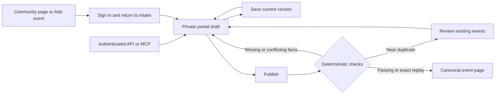

# Event intake drafts and publication

Event intake accepts a signed-in VRDex account, including an account without a
verified email. Publication targets any published, publicly surfaced community.
It does not require community ownership, staff membership, or an acceptance queue.

## Commands

Browser clients use `eventIntake.saveEventIntakeDraft`, `getEventIntakeDraft`, and
the `publishEventIntake` action. Save accepts `{ draftId?, expectedVersion?, patch }`
and returns `{ draftId, version }`. Updating requires both the ID and current
version. Get accepts `{ draftId }` and returns the actor's private draft.
Publish accepts `{ draftId, expectedVersion, idempotencyKey }` and returns
`{ eventId, receiptId, eventPath }`. Clients navigate to `eventPath` on success.

Trusted API adapters use the internal `saveActorDraft`, `getActorDraft`, and
`publishActorIntake` equivalents with `actorUserId` bound from their validated
credential. Never accept this identity from a request body. The browser action
resolves it through `currentIntakeActor` and `requireUser`.

## Draft contract

The strict schemas and TypeScript types live in
`packages/api-contracts/src/event-intake.ts`. Omitted top-level patch fields stay
unchanged, `null` clears a value, and empty strings normalize to unknown. Nested
objects and the lineup array replace their previous value as a unit. A lineup
row has a stable `clientKey`, `position`, and optional performer, role and times.
Those structural fields alone do not constitute a meaningful draft.

One meaningful input is enough to save. `sourceText`, `posterSourceId`, and a
bounded `posterDeclaration` of MIME/bytes/SHA-256 remain private. The declaration
allows a poster-only draft before upload and inherits ordinary draft quotas and
expiry. It does not confirm source bytes or satisfy publication minimums. The poster reference is an opaque integration reference, not a public
artwork URL or permission to read storage. The source service must validate its
actor and purpose before reading or attaching any source bytes. `tentative` holds
candidate fields separately; only ordinary fields can become canonical.
`questions` holds up to 100 unresolved extraction questions, with 2,800 characters
per question to preserve the field, reason, and alternatives without truncation.
The overall draft payload limit still applies. The server records the last
authored version and whether each top-level field is tentative or contributor
authored in `provenance`.

Drafts have a 48,000-character JSON payload ceiling and a maximum of 20 unexpired
rows per actor. Each save renews the 30-day draft expiry. The hourly sweep deletes
at most 100 expired drafts. Receipts and request bindings survive draft deletion.
Private source-file retention is a separate source-service responsibility.

## Publication

Publication requires a public community, an identifying title, a valid event
date, and either a start time or explicit `timeTba: true`. A source URL is optional.
Confirmed `worldSlug` and `lineup[].personSlug` matches are rechecked at publication.
Unmatched lineup names are preserved. An incomplete lineup row remains valid in
a draft but needs a performer label before publication.

Times use `{ time: "HH:mm", dayOffset?, occurrence? }`. `dayOffset` is explicit
cross-midnight intent relative to the event date. `occurrence` is `earlier` or
`later` for a repeated local time. Timed publication requires a valid IANA
timezone; date-only publication does not. `resolveEventLocalTime` returns zero,
one, or multiple instants. `selectEventLocalTime` rejects gaps and unresolved
repeated hours. Canonical schedules use `normalizeEventSchedule`.

The actual commit mutation calls `requireDateOnlyEventsEnabled` before inserting
a date-only canonical event. Keep `EVENT_DATE_ONLY_ENABLED` disabled until the
schedule migration and index readiness checks have passed. Legacy timed events
continue to work with the switch disabled.

Preflight applies strict text and link bounds, actor and target eligibility,
10 new publication receipts per actor per rolling day, 100 per community per
rolling day, and 100 new idempotency bindings per actor per rolling day. An
existing key replays without consuming another allowance. These are current
implementation defaults, not promised product limits.

Duplicate identity is the community ID, calendar date, and normalized title.
Existing timed events without migrated date fields are checked in a bounded
time window. An exact public match returns its event and one canonical receipt.
If a legacy match has no slug, publication first creates its canonical route and
refreshes search from the existing event and associations. It preserves that
event's content instead of applying fields from the duplicate draft.
An exact unpublished or cancelled match refuses recreation. A same-day title
overlap or matching source URL produces a `NEAR_DUPLICATE` error with up to 20
`choices` containing `eventId`, `title`, and `eventPath`. The contributor can save
the reviewed IDs in `duplicateAcknowledgements` and publish that new version.
Unrelated same-day titles do not prompt. Candidate scans fail closed above their
100-row bounds.

The action has a disabled `classifyEventIntakeForPublication` hook. It performs
no model call. A future classifier must bind its result to the checked draft
version and run within evaluated cost/availability policy. The internal
`commitPublishIntake` mutation always rechecks version and deterministic preflight.
It atomically writes the canonical event, short link, lineup, world association,
search document, receipt, and actor-bound request binding. Concurrent duplicate
attempts converge on one canonical event and receipt.

## Attribution and correction integration

Published records have `sourceType: "contributor"` and source label
`Community-submitted`. Public projections omit contributor identity, private
source text, poster references and draft provenance. Private source posters
never become event artwork implicitly. Participants and worlds retain the
contributor source type. The existing association `confirmed` state means the
association is published, not that a community owner endorsed it.

Canonical contribution metadata is `contributorUserId`, `contributionVersion`,
`contributionFingerprint`, optional `contributorEditsClosedAt`, and
`contributorLockRevision`. Published drafts are immutable; use the correction
commands below to change the canonical event.

## Correction commands

`eventCorrections.getOwnContributedEvent({eventId})` returns `eventId`,
`updatedAt`, `contributionVersion`, and editable `fields` reconstructed from the
canonical event and lineup. It never returns private source evidence.
`updateOwnContributedEvent({eventId, expectedUpdatedAt, patch, duplicateAcknowledgements?})` allows only the
original contributor while the listing is published, scheduled, and not taken
over by staff. It returns the new `updatedAt` and `contributionVersion`.

The patch keys are `title`, `eventDate`, `timeTba`, `timezone`, `start`, `end`,
`doors`, `venueLabel`, `worldSlug`, `sourceUrl`, `summary`, and `lineup`. Local
times and lineup rows use the intake contract above. Omitted fields remain;
empty or null optional text clears the field. Arrays replace as a unit. When
switching to TBA, clear event/set times explicitly. Community attachment,
source attribution, trust, private evidence, and watch controls are rejected.

Every correction compares `expectedUpdatedAt`, validates the resulting complete
listing with publication preflight (excluding itself from duplicate matches),
and validates the lineup. It does not spend new-publication quota. An exact
match to another listing returns `DUPLICATE_EVENT`; near matches return
`NEAR_DUPLICATE`. Retry with the reviewed event IDs in the optional command-level
`duplicateAcknowledgements` array, bounded to 100 IDs, outside `patch`. Confirm
near matches again for each correction, including previously acknowledged
publication matches. This does not bypass exact duplicate or suppression checks.
The transaction updates canonical content, search and
participant/world projections and records changed fields with actor identity.

`retractOwnContributedEvent({eventId})` hides and audits the contributor's own
listing before staff takeover. Community owners and `manage_events` staff retain
the existing edit, cancel, unpublish and republish commands. Every staff content
or publication/status change sets `contributorEditsClosedAt` and increments
`contributorLockRevision` in the same transaction. The explicit
`takeOverContributedEvent({eventId})` command closes editing without changing
content. Subsequent contributor mutations return `CONTRIBUTOR_EDIT_CLOSED`,
including mutations with a fresh revision. UI correction suggestions after
takeover remain a separate workflow; a stale direct edit never becomes one
automatically.

Trusted transports can use internal `getActorContributedEvent`,
`updateActorContributedEvent`, and `retractActorContributedEvent` with the same
arguments plus `actorUserId`. Derive that ID from the authenticated credential,
never the request body. The internal mutations record this ID in event audits.
Browser commands derive their actor from the active session.

## Reports and removal

`reportEvent({eventId, reason})` accepts signed-out visitors, records identity
when available, and returns `{accepted: true}`. Reasons must contain 5 to 500
trimmed characters. Reports never change publication or automatically remove an
event. Server-side rolling limits allow 20 reports per event per 24 hours,
500 reports globally per hour, and 10 reports per signed-in account per 24 hours.
These limits share the mutation transaction with the insert. No caller-supplied
client key or IP is accepted, so rotating either cannot bypass the event/global
bounds. A malicious caller can exhaust those shared limits and delay legitimate
reports. A future trusted HTTP layer can add IP-based admission, but must retain
these limits since the public Convex mutation remains directly callable.

`listEventReports({cursor, limit})` accepts a null initial cursor and a limit
from 1 to 100. Only community owners, `manage_events` staff and accounts with an
active `super_admin` grant can read it. Staff see only their communities; moderators
see all reports. Its page can be empty before `isDone` because authorization
filters a bounded global page. Continue with `continueCursor`. Private
`eventReports` rows may also carry `kind: classifier_outage` or `classifier_sample` for a trusted
classifier commit to insert. Neither reports nor outage flags enter public
event projections.

`removeContributedEvent({eventId, reason})` separately requires an active
`super_admin` grant. Community event authority alone does not grant removal.
The mutation hides the event, closes contributor editing, updates search and
participant/world projections, and records the moderator and reason in the
audit. Removed listings cannot be republished through ordinary staff commands.
Public page and calendar-export reads return no event; upcoming, community,
person and world feeds omit it. Already-cached exports retain their existing
cache lifetime, and files already downloaded cannot be recalled.

A removal computes the community/date/normalized-title fingerprint from the
current canonical event, including staff corrections, and stores it for 30 days.
Preflight rejects matching publication even if the canonical row is gone. The
hourly cleanup deletes at most 200 expired suppression records per run. Expired
records stop blocking immediately, independent of cleanup backlog. The removed
canonical row stays hidden. This is exact-match prevention, not fuzzy spam
detection; title/date changes can evade it.

## Private posters and optional extraction

See [source storage and model controls](./event-intake-sources.md) for private
upload intents, explicit artwork selection, retention, bounded extraction and
default-off spam classification. The manual path has no model-key dependency.
