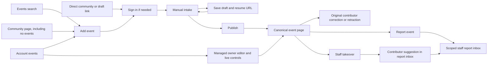

# Browser event contribution

The browser intake at `/events/new` uses `eventIntake.saveEventIntakeDraft`,
`getEventIntakeDraft`, and `publishEventIntake`. The `community` query parameter
preselects a community. Saving sets a resumable `draft` URL and stays on the form.
Publishing replaces the route with the command's canonical `eventPath`.

Timezones are selected from the runtime IANA list with city and regional aliases.
Abbreviations are search terms, not stored fixed offsets. Offsets use the event
date. Repeated local hours require an occurrence choice and missing local hours
cannot publish. Existing owner timestamps remain exact when unchanged.

`getEventContributionAccess` returns capabilities only. Contributor identifiers
stay out of the public event DTO. Correction mutations retain server authorization
and optimistic revision checks. Staff takeover closes direct contributor editing;
the subsequent suggestion goes through `reportEvent`, not a second store.
`/account/events/reports` checks staff access before querying its paginated inbox.

Manual intake remains available without extraction. Source text is private draft
input. Task 6 extraction still needs to attach tentative candidates and explicit
acceptance to this form. Date-only publishing remains subject to the backend
`EVENT_DATE_ONLY_ENABLED` gate.

Browser fixtures test form behavior and navigation without a live Convex backend.
The intake fixture uses session storage. The owner fixture exercises the real
editor serialization through a local Convex transport. Neither proves a live
authenticated backend journey. Backend tests independently cover authorization,
publication, corrections, reports, and takeover.
