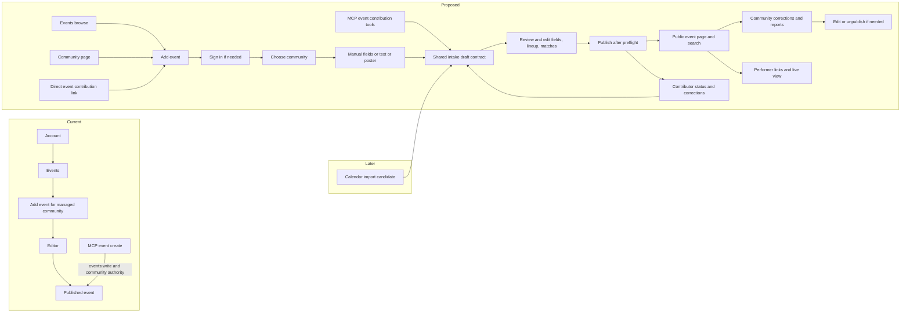

# Event contribution and AI intake research (2026-09-25)

Status: research and candidate direction. BASIC decided on 2026-09-25 that events contributed for any community must be able to publish and enter search immediately after a reasonable smell test, without prior community or moderator acceptance. BASIC also approved publishing a known-date event with its time TBA and keeping almost all fields partial while drafting. This is not an approved implementation plan. See [AI platform research](./event-intake-ai-platform-research-2026-09-25.md) for official OpenAI capability and data-handling sources.

## Problem and current path

An event can currently be created in the browser from Account > Events > Add event only when the signed-in user owns or has `manage_events` for the community. `/events/new` redirects back to the account page. The `vrdex_event_create` MCP tool uses `events:write` and the same community authority, then publishes. There is no ordinary outsider event proposal, community review queue, or poster/text extraction path.

The canonical `EventDraftInput` requires a title and `startAt`; timed slots require their own start times and a timezone. `eventParticipants` require matched person profiles. These are appropriate publish constraints but cannot hold a partially read poster, an untimed lineup, or an unresolved performer identity. The public event page shows timed slots and linked participants separately. A shared intake object must preserve entries that cannot yet be expressed as either canonical type.

Google Calendar has private `eventImportBatches`, `eventImportCandidates`, and field records with provenance and review state. Those tables are provider-specific and have no current publish UI. Media contributions already demonstrate a private proposal, own-status, review, and approved-publication lifecycle. These are patterns to reuse, not evidence that event intake already exists.

Repo sources: [event authoring](../../convex/events.ts), [event input contract](../../convex/_eventInputs.ts), [event schema](../../convex/schema.ts), [account events page](../../apps/web/src/app/account/events/managed-events-panel.tsx), [MCP event writes](../developers/vrdex-mcp-event-writes.md), [calendar import plan](./calendar-integration.md), and [media contribution model](./event-profile-media-slice.md).

## Approaches

| Approach | Benefit | Problem |
| --- | --- | --- |
| Add AI prefill and an outsider mode to the existing event editor | Smallest apparent UI change | Its required title/time and linked participant contract cannot represent partial source material; owner controls and contributor controls would mix. |
| Share a partial intake contract/editor, then publish a completed draft directly to canonical events | One web/MCP flow, immediate public result, no universal proposal queue | Needs an intake-to-publish conversion and targeted provenance/moderation records. |
| Persist every intake in a new proposal lifecycle before conversion | Durable recovery and review state for every attempt | High-frequency immediate publishing would make most proposal rows and review states redundant. |
| Generalize the Google Calendar import candidate tables for all sources now | Reuses field-level review storage | Calendar batch IDs, recurrence, cancellation, and sync state would burden single-contributor drafts and make migration riskier. |

Current recommendation: the shared partial intake contract/editor with direct publication when complete. Borrow calendar field-provenance and media-review evidence rules, but do not route ordinary events through either import or proposal tables. A review queue is for flagged material, reports, and corrections after publication; it is not a universal prepublication gate. Adapt calendar candidates into the same intake type later if import publishing is built. Keep one cohesive implementation PR if the design can be reviewed and verified end to end.

## Candidate boundary

One typed intake payload holds: target community; source kind (`manual`, `text`, `poster`, later `calendar`); source text and/or private poster reference; partial event fields; ordered lineup entries with optional local time, optional linked person, and original label; and per-field origin/evidence/uncertainty. Manual entry and AI extraction create the same shape. The browser and MCP call the same server validation and authorization rules. Any signed-in contributor should be able to choose any public community, whether claimed or unclaimed. Email-verification policy remains to be checked against the desired low-friction journey. A complete payload writes a canonical event directly. Incomplete work can be saved as a private resumable draft across website and MCP; this draft is not a proposal awaiting community acceptance.

AI is a bounded server-owned interpretation step. It can request narrow read-only people/community lookup and deterministic timezone/time resolution, then returns a strict schema. Server code verifies every returned ID and validates time resolution and bounds before returning the editable draft. The contributor reviews and edits it before an explicit publish action. The AI never calls publish or event-create tools. A model's confidence is a review hint, not proof. A contributor edit changes provenance to contributor-asserted, not community-confirmed.

Candidate output type, subject to reconciliation with the existing event contract:

```ts
type EventIntakeExtraction = {
  event: {
    title: string | null;
    communityLabel: string | null;
    communityCandidateId: string | null;
    dateLocal: string | null;
    startLocal: string | null;
    endLocal: string | null;
    timeZone: string | null;
    summary: string | null;
    venueLabel: string | null;
    sourceUrl: string | null;
  };
  lineup: Array<{
    order: number;
    performerLabel: string;
    personCandidateId: string | null;
    roleLabel: string | null;
    startLocal: string | null;
    endLocal: string | null;
    matchState: "matched" | "possible" | "unresolved";
  }>;
  evidence: Array<{
    fieldPath: string;
    origin: "text" | "poster" | "lookup" | "calculation";
    excerpt: string | null;
    assessment: "explicit" | "inferred" | "conflicting";
  }>;
  questions: Array<{
    fieldPath: string;
    reason: string;
    alternatives: string[];
  }>;
};
```

The model output excludes actor, status, approval, and publication fields. Every root/object property is present, with `null` for unknown values, to fit strict structured output. The server wraps it with authenticated actor, target authorization, source reference, version, and lifecycle state. Tool candidates are bounded public projections only: `search_people(query, limit)`, `search_communities(query, limit)`, and `resolve_local_time(date, time, zone)` returning zero, one, or multiple valid instants. The agent cannot search private profiles or ask tools to mutate records. This is a design sketch, not an approved schema.

Drafts can retain unknown title, community match, date, time, timezone, venue, lineup, alternate identities, and untimed lineup names. Saving a draft needs one meaningful input but does not require publication minimums. Publication requires enough resolved fields to make a useful event, canonical validation, an idempotent write, and duplicate checks. A known date with no time publishes as time TBA, not as a fabricated midnight timestamp. Store a compact provenance and preflight receipt alongside a published event, and keep any private source poster only for a bounded correction/report window. The source poster does not become public event art merely because it was parsed.

Locked publication rule: prior acceptance by the named community or a moderator is not required. A valid submission that passes preflight becomes a normal published `events` row, searchable, visible on the community page, and available by direct URL at once. Existing event insertion already writes the public search document in the same publication path. It remains labeled by source rather than implied to be owner-confirmed. Current event docs say unrelated users cannot publish for a community and only owners/staff can manage an event; this new policy intentionally changes the creation boundary. Current community owner/`manage_events` authority should retain immediate edit, cancel, and unpublish power over attached events. The submitter is provenance, not a community authority grant.

Current recommendation for the preflight: authenticated actor, bounded per-account and per-target rate limits, valid target and event fields, safe allowed links, exact duplicate detection plus near-duplicate warning, and a fast content check. OpenAI's [moderation endpoint](https://developers.openai.com/api/docs/guides/moderation) checks harmful-content categories and is free according to its current docs, but it does not offer an event-spam or truthfulness category. A low-cost event-spam classifier would be a separate task-specific model call, ideally evaluated in shadow mode on real submissions before it can block publication. Use a high-confidence threshold for a hard block; send borderline cases to prompt post-publication review while keeping ordinary events immediately visible. Do not equate AI passing a smell test with the community confirming that the event is real. If AI checking is unavailable, deterministic checks and quotas remain the minimum gate; the exact outage policy needs to be chosen before launch.

Immediate publication makes correction and removal part of the core slice, not later polish. A community owner/staff member must be able to edit or unpublish an attached contributed event promptly; moderators need an independent removal and audit path; any visitor needs an event-specific report action. Current `canUpdateEvent` covers only community ownership/`manage_events`, so the moderator path cannot be assumed to exist merely because older planning mentioned suppression. Reports alone do not silently retract a listing. Public reads, search, feeds, and community pages must all honor removal. A removed event fingerprint needs a bounded resubmission guard so another account cannot instantly recreate the same listing. The contributor needs a way to see their published item and submit a correction without gaining general `manage_events` authority. Exact self-edit scope remains a design question.

For outside contributors, keep live watch mode, explicit stream selection, and arbitrary event-media controls out of the initial publishable field set. Performer links should derive from existing matched public profiles, not from an event submitter's claimed stream URL. This preserves the useful lineup/link sheet while preventing an outsider from redirecting a live event watch surface.

## Journey to test



The proposed `Add event` entry is available even when the user manages no community. Direct community links preselect that target. Returning from sign-in preserves the draft. Exact public-facing labels and explanatory copy require BASIC's review before shipping.

## Research and decisions still needed

1. What minimum fields allow an event to publish? Current recommendation: named public community, identifying title, and date. A time may be TBA, while source URL or poster is helpful evidence but not a mandatory barrier to manual contribution. Missing core fields remain an editable draft; owner acceptance is never required for otherwise valid publication.
2. What may the original contributor edit after publication, and which changes must pass the same preflight or become a correction suggestion?
3. How should untimed and unmatched lineup names appear after publication? Canonical participants require a person ID and slots require a start time, so a public freeform lineup representation may be needed.
4. What source retention, deletion, and consent rules apply to posters and third-party names? Existing VRDex Time privacy scope explicitly excludes general poster intake pending review.
5. Which deterministic time tool should the agent use? The existing VRDex Time endpoint is beta-gated; compare internal reuse against direct time utilities on an evaluated poster fixture set. The current browser `parseZonedDateTimeInput` chooses the earliest matching instant during a repeated DST hour, so it cannot be reused unchanged for ambiguous poster times. Return both candidates and request human resolution.
6. What parser and event-spam classifier quality, latency, and cost thresholds justify launch? Evaluate clear, dense, cross-midnight, timezone-ambiguous, conflicting, adversarial, and false-event posters; measure false identity matches and false spam blocks separately from field extraction.
7. What happens when the optional AI classifier is unavailable, and how quickly are high-volume submissions sampled or reviewed after publication?

This note does not authorize model API spending, production data writes, grants, or publication.
