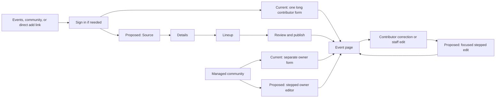

# Event editor changeset map (2026-09-29)

Source scope amended by the approved [single-poster plan](../superpowers/plans/2026-09-30-event-intake-single-poster.md) on 2026-09-30.

Status: **Current recommendation**, local planning draft. BASIC approved including contributor creation and correction plus owner/staff create and edit on 2026-09-29. This maps the difference between the [four-step visual reference](./event-editor-visual-reference-2026-09-29.md) and the implementation at commit `9c1406423`. It is not a product behavior change.

## Journey

## Existing seams

| Area | Current implementation | Required difference |
| --- | --- | --- |
| Contributor UI | `event-intake-form.tsx` renders the source, all details, lineup, duplicates, and publish controls in one form; `event-intake-source.tsx` holds one poster preview and a separate artwork button. | Four steps with one draft state, one-poster and optional text Source, contextual preview, inline candidate review, actual lineup dates, and a compact Review step. |
| Owner/staff UI | `event-editor-form.tsx` is a separate large form combining public event data, lineup, media, watch/output controls, and operations. | Reuse the visual steps for public event authoring while preserving owner-only operations and the existing `events:write` authority boundary. Keep canonical staff writes separate from contributor publication. |
| Contributor correction | `event-contribution-controls.tsx` opens the same long intake fields inline on the public page. | Reuse the editor's Details/Lineup/Review presentation without granting source, community, or live-control edits. |
| Shared contract | `packages/api-contracts/src/event-intake.ts` carries `sourceText` plus one `posterSourceId`; `extract` accepts one `posterAssetId`. | Keep the singular fields and combine optional text with one poster. |
| Source storage | `eventPosterSources` already supports multiple rows per draft and private retention, but upload, draft read, and extraction authorize one source at a time. | Validate one saved poster against its actor/draft, support replacement/removal, and retain private evidence. |
| Artwork | `artwork_select` explicitly prepares a WebP derivative and increments the draft version. Publication uses the selected derivative. | The uploaded poster is artwork automatically; replacement changes it and removal clears it. Preserve the public derivative and private evidence as distinct assets. |
| Discovery agent | `event-intake-agent.ts` already has one bounded Responses loop, structured candidate output, and read-only people/community/time tools. It sends one image with text. | Send one poster and optional text in one run, record evidence origin, and preserve tentative values and unresolved questions through draft resume. |
| Time and lineup | Contributor `IntakeTime` exposes `Day offset`; candidate times only contain `HH:mm`. Owner editing already has `EventTimezonePicker` and local date-time inputs. | Reuse the timezone picker, author actual local dates across midnight, and convert to the existing canonical `dayOffset` wire value. Carry an inferred slot date or an explicit uncertainty through extraction. |

The current source table and artwork table likely need no new table. The shared contract, actor/draft validation, version handoff after automatic artwork preparation, and stale-candidate invalidation need focused review. Existing publication preflight, idempotent receipts, contributor permissions, event routes, public lineup, and live playback should remain the authority and output paths.

## Expected diff

| Responsibility | Likely files |
| --- | --- |
| Shared input, output, and candidate shape | `packages/api-contracts/src/event-intake.ts` |
| Private source authorization and initial artwork lifecycle | `convex/eventIntakeSources.ts`, `apps/web/src/lib/server/event-poster-storage.ts`, `apps/web/src/lib/server/event-intake-api.ts` |
| One text-plus-poster discovery run | `apps/web/src/lib/server/event-intake-agent.ts`, `apps/web/src/lib/event-intake-source.ts` |
| Website draft, source, and four-step presentation | `apps/web/src/app/events/event-intake-form.tsx`, `apps/web/src/app/events/event-intake-source.tsx`, focused step components beside them if needed |
| Other authoring paths, if included | `apps/web/src/app/events/event-editor-form.tsx`, `apps/web/src/app/events/event-contribution-controls.tsx` |
| Contract adapters and tests | `apps/web/src/lib/server/event-intake-session.ts`, `packages/vrdex-mcp/src/api-client.ts`, existing contract, backend, web, MCP, and Playwright tests |
| Behavior docs | `docs/backend/event-intake.md`, `docs/backend/event-intake-sources.md`, `docs/developers/public-api.md`, `docs/developers/vrdex-mcp-event-writes.md` |

No canonical event schema migration or new image table is indicated by the current code. Do not include live playback, VRCDN output, or a public event-page redesign in this diff.

## Decisions to pin before implementation

- The uploaded poster is artwork. A new upload replaces it; removal clears it.
- Failed processing must expose a retry or removal path. Return the draft version
  after artwork preparation so the next save does not conflict.
- Preserve singular `posterSourceId` and `posterAssetId` inputs. Validate the
  source's actor, draft, readiness and expiry. Remove unshipped plural inputs.
- A source change must invalidate stale tentative suggestions and evidence without discarding confirmed manual edits. Evidence must identify whether the poster or text supplied it and survive draft resume if it remains relevant.
- **Locked decision:** The stepped presentation covers contributor creation and correction and owner/staff creation and editing. Correction can omit a Source step because its current permission set does not include new private evidence or artwork. Staff Source uses its existing media and link controls; the shared AI discovery run is required for contributor intake, not a new canonical staff upload path. Preserve each path's existing permissions and commands.

## Recommended implementation order

1. Keep one shared singular contract across browser, API, MCP and Convex.
2. Prepare poster artwork automatically and idempotently, preserving the
   existing singular artwork command and version checks.
3. Submit optional text and one poster in one bounded discovery run, retaining
   manual entry, tentative evidence and unresolved questions.
4. Build the stepped contributor editor using existing timezone and publication rules. Keep partial drafts, matched and unmatched lineup entries, duplicate review, and direct navigation after publish.
5. Apply the shared presentation to owner/staff authoring and contributor correction without merging their backend permissions or live-control commands.

The implementation should be one cohesive changeset with internal testable checkpoints. Do not open a planning PR. Verify contract/Convex/web/MCP tests, desktop and mobile flows, screenshot review, and the docs that describe authoring, media, and MCP behavior.
