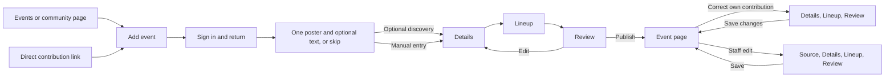

# Event editor visual reference (2026-09-29)

Status: Implemented locally in the event-editor changeset, pending review and deployment. These generated screens are visual references, not pixel-perfect specifications or approval of their exact copy. The Lineup image was the initial saved reference; the other steps are companion drafts.

## Direction to preserve

- Keep VRDex's header and footer. Put Source, Details, Lineup, and Review across the top of the editor instead of adding a sidebar.
- Let contributors enter details manually or provide one poster and optional text together, then review partial details and lineup guesses before publishing.
- An event poster **is** the event artwork. It appears in the preview and is published with the event; there is no separate artwork opt-in. The public artwork and private source evidence remain distinct assets with distinct visibility and retention after publication.
- Show lineup entries with profile pictures and actual dates for sets crossing midnight. Do not expose a `Day offset` field.
- Keep a contextual preview beside the editor on wide screens. Adapt the layout for narrow screens rather than preserving the exact columns.

The pictured event, performers, artwork, labels, spacing, and preview time formatting are illustrative. Some generated sample details differ between screens. Apply the existing design system and public-copy review rule during implementation. Public event times should follow the viewer's local timezone rule. The implementation uses the existing design system; the generated screens remain illustrative.

## Source

**Locked decision, amended 2026-09-30:** A contributor can provide one poster,
optional text, or both, and submit them in one discovery run. Tentative details,
lineup entries, private evidence and unresolved questions remain reviewable.
Bounded read-only person, community and time lookups cannot publish. Manual
entry works without sources or a model call.

The poster is artwork automatically. A new upload replaces it, and removal
clears it. There is no gallery, primary selection or fallback. Private source
evidence and the processed public derivative remain distinct. The historical
mockup's multiple images are superseded by the approved
[single-poster plan](../superpowers/plans/2026-09-30-event-intake-single-poster.md).

## Details

Keep the community, title, date, optional time, timezone, venue, and description together. Search timezone names and common aliases; save a canonical zone. Show uncertain discoveries where they can be corrected. Partial details may remain in a draft.

## Lineup

Keep one lineup with profile pictures, matched or unmatched performers, and actual dates across midnight. Do not expose a `Day offset` field.

## Review

Summarize confirmed details with direct edit routes back to the relevant step. Show publication blockers and similar-event checks only when they apply. Save draft remains available; publishing goes directly to the event page.

## Journey

## Implementation status

Contributor intake, staff create/edit, and contributor correction share the top
step navigation and responsive preview. Correction omits Source and restricted
controls. Staff live/output operations remain under Advanced in Review.
Lineup rows show matched portraits or name fallbacks and actual local dates.
Existing publication preflight, stale revision rejection, and separate staff
and contributor permissions remain in force.

Desktop/mobile fixture screenshots and browser checks cover the real forms with
local transports. Hosted authentication, S3 delivery, model-provider accuracy,
and live output writes require separate deployment evidence. BASIC approved the
exact public copy `Maximum 5 images` on 2026-09-30. The approved single-poster
simplification removes that message.
