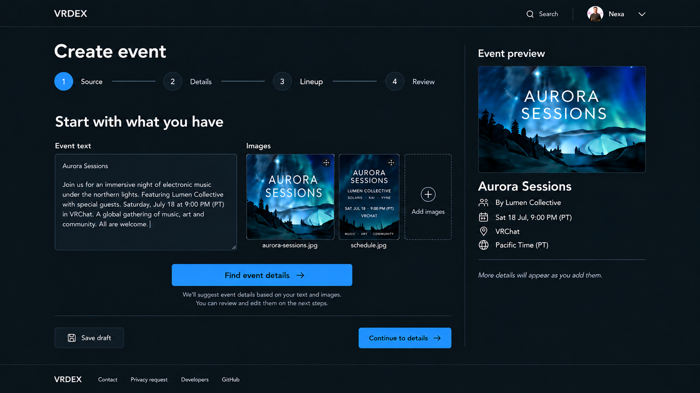
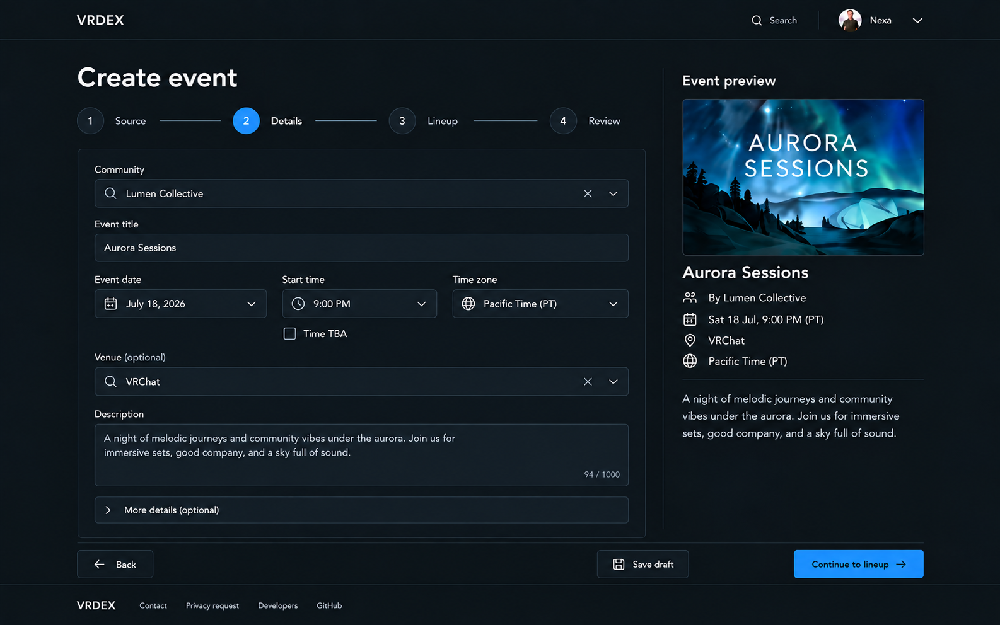
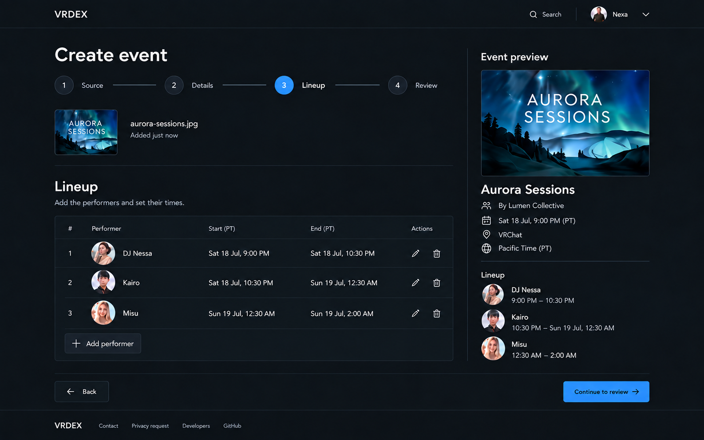
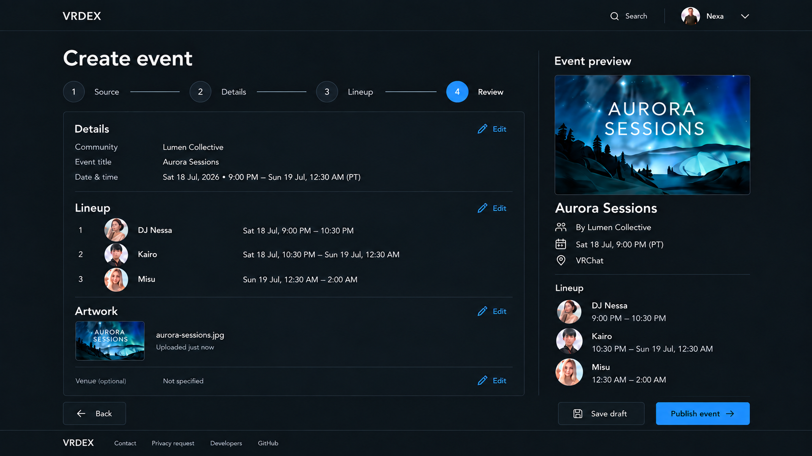
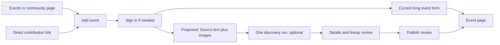

# Event editor visual reference (2026-09-29)

Status: **Current recommendation** for a future event-editor redesign. These generated screens are visual references, not pixel-perfect specifications or approval of their exact copy. The Lineup image was the initial saved reference; the other steps are companion drafts.

## Direction to preserve

- Keep VRDex's header and footer. Put Source, Details, Lineup, and Review across the top of the editor instead of adding a sidebar.
- Let contributors enter details manually or provide text and images together, then review partial details and lineup guesses before publishing.
- An event poster **is** the event artwork. It appears in the preview and is published with the event; there is no separate artwork opt-in. The public artwork and private source evidence remain distinct assets with distinct visibility and retention after publication.
- Show lineup entries with profile pictures and actual dates for sets crossing midnight. Do not expose a `Day offset` field.
- Keep a contextual preview beside the editor on wide screens. Adapt the layout for narrow screens rather than preserving the exact columns.

The pictured event, performers, artwork, labels, spacing, and preview time formatting are illustrative. Some generated sample details differ between screens. Apply the existing design system and public-copy review rule during implementation. Public event times should follow the viewer's local timezone rule. This reference does not change the current product behavior.

## Source

**Locked decision:** A contributor can provide text, multiple images, or both, and submit all current sources to one event-discovery run. The agent returns tentative event details, lineup entries, evidence tied to each source, and unresolved questions. It may use bounded read-only person, community, and time lookups, but cannot publish. The contributor edits or accepts suggestions in the later steps. Manual entry works without sources or a model call.

**Locked decision:** The first uploaded image starts as the main event artwork, and the contributor can change it. Other images can supply schedule or venue details without all becoming public artwork. The mockup's image placement remains illustrative.

The current shared website/API/MCP contract and extraction loop accept text plus one poster. Future implementation must extend the shared draft, upload, extraction, evidence, and preview paths for multiple images while retaining input limits and the separate private-evidence lifecycle.

## Details

Keep the community, title, date, optional time, timezone, venue, and description together. Search timezone names and common aliases; save a canonical zone. Show uncertain discoveries where they can be corrected. Partial details may remain in a draft.

## Lineup

Keep one lineup with profile pictures, matched or unmatched performers, and actual dates across midnight. Do not expose a `Day offset` field.

## Review

Summarize confirmed details with direct edit routes back to the relevant step. Show publication blockers and similar-event checks only when they apply. Save draft remains available; publishing goes directly to the event page.

## Journey

