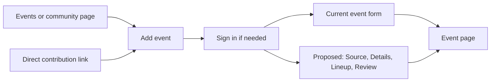

# Event editor visual reference (2026-09-29)

Status: **Current recommendation** for a future event-editor redesign. BASIC approved saving this generated mockup as a direction to revisit, not as a pixel-perfect implementation spec or approval of its exact copy.

## Direction to preserve

- Keep VRDex's header and footer. Put Source, Details, Lineup, and Review across the top of the editor instead of adding a sidebar.
- Let contributors start with manual details, freeform text, or a poster, then review partial details and lineup guesses before publishing.
- An uploaded event image becomes the draft event artwork automatically and appears in the preview. Publishing the event publishes that artwork unless the contributor changes or removes it first. No separate artwork checkbox. The unpublished draft and its source evidence remain private.
- Show lineup entries with profile pictures and actual dates for sets crossing midnight. Do not expose a `Day offset` field.
- Keep a contextual preview beside the editor on wide screens. Adapt the layout for narrow screens rather than preserving the exact columns.

The pictured event, performers, artwork, labels, spacing, and preview time formatting are illustrative. Apply the existing design system and public-copy review rule during implementation. Public event times should follow the viewer's local timezone rule. This reference does not change the current product behavior.

## Journey

