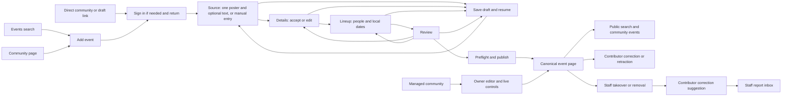

# Event Routing And Authoring

Contributor editor (2026-09-29): [visual reference](./event-editor-visual-reference-2026-09-29.md). Contributor creation now uses Source, Details, Lineup, and Review inside the existing header and footer. Owner/staff and correction presentation remain separate pending the next implementation tasks.

## Status

Current implementation incorporates the 2026-08-31 owner-editor decisions and the
2026-09-25 contribution design. The contribution path supplements owner authoring.

- Owner/staff event creation remains at `/<community>/events/create`.
- Any signed-in account can contribute at `/events/new`, including through
  `?community=<slug>` and resumable `?draft=<id>` links. No managed community or
  separate verified-email gate is required for contribution.
- Events do not use the root profile and world slug namespace.
- The owner editor freeform world field is removed. Searchable indexed world selection is deferred to #279.
- Owner-editor doors open is authored as minutes before the event start, not as a second timestamp.
- New owner-editor schedules start with four 60-minute slots.
- Slot count and duration changes update untouched generated slots without a Generate action.
- Untimed performers share the lineup with timed slots. The editor uses `Slots`
  and `Slot N`; these headings are not saved performer names.
- Event URLs use the automatically generated seven-character short-link code.
- Event URL codes are not editable and do not occupy the root profile and world
  slug namespace.
- The owner browser editor calls the session area `Schedule`, not `Program`, `Lineup`,
  or `Set times`.
- The browser editor has one public Description field. Private notes are visible
  only to authorized event managers.

Current recommendation:

- Use `/<community>/events/<event-code>` as the canonical public route and
  `/<community>/events/<event-code>/edit` as the editing route.
- Keep the optional stored event end time for public/API compatibility, but do
  not ask owner-editor authors for it in this slice. Derive the submitted end from
  the final slot when the schedule has complete durations.
- When template controls would replace edited schedule data, require confirmation.

## Owner authoring flow

1. Start from a managed community.
2. Enter the event title and public details.
3. Set the local start time, timezone, and optional doors-open offset.
4. Fill the four generated 60-minute slots or adjust the template.
5. Publish or save a draft.

The owner editor binds the community from the route and rechecks management
authority. The contribution form can select any public community. A useful
contribution needs a community, title and known date. An explicit Time TBA state
needs no timezone; timed publication needs an IANA timezone and resolved local
time. The date-only backend switch must be enabled after its migration.

Manual entry, pasted text and one private poster share one
controlled versioned draft across the contributor steps. One extraction submits
the current text and poster together. Details and Lineup retain tentative values
for explicit acceptance, source evidence, and unresolved questions on resume.
Changing sources invalidates suggestions and evidence while keeping accepted fields.
Unavailable extraction stays on Source with visible feedback and manual Continue.

The poster becomes artwork after verified upload and processing. A new upload
replaces it; removal clears it. Private evidence and public artwork derivatives
remain separate. Uploads and saves retain draft version checks. No gallery,
primary-image selection or fallback remains in contributor intake.
A failed completion response retains Retry even when the source preview is available.
Retry replays completion before saving later edits and preserves conflict checks.

Lineup rows show matched public profile pictures with a name fallback. Native
local dates and times map to the existing day-offset contract; numeric offsets
are not exposed. Repeated hours retain an explicit occurrence choice. The side
preview uses viewer-local timed dates and moves below the editor on narrow screens.

Review uses the confirmed start date, including its day offset, and links back to
Details and Lineup. Preflight reveals and focuses missing or unresolved fields; similar events appear only after the existing duplicate check finds them.
Publish goes directly to the canonical event page. Save draft remains available
at every step and stays in the editor. Unknown dates remain drafts.

Staff takeover or a staff edit closes direct contributor editing. Subsequent
suggestions use the event report inbox. Reports never automatically remove an
event. Removal hides public detail, search and feeds and suppresses immediate
exact recreation. See the [verification checkpoint](../testing/event-intake-checkpoint.md)
for local evidence and outstanding hosted checks.

## Data And Routing Contract

- Browser routing and identifier allocation keep events out of the root profile
  and world slug namespace.
- Browser, public page, calendar, cards, Discord export, API, and MCP event
  lookups use the event code. The existing internal `slug` field name remains
  the wire/storage key for now, but its event value is the generated code.
- Public browser routes include the community slug for context and verify that
  the event belongs to that community before rendering.
- Event link-preview metadata and images use that same community-bound lookup;
  the event code alone cannot render a card under the wrong community route.
- API routes remain under `/api/v0/events/<event-code>` because the resource prefix
  already disambiguates the identifier.
- Event URL allocation does not migrate routes. The separate schedule backfill
  is required before enabling date-only writes.

## Authorization

- The route is not authority. Owner authoring requires ownership or
  `manage_events`; contribution uses separate actor-bound publication commands
  and `events:contribute` API/MCP scope. It does not grant live/media controls.
- Editing verifies both the event code and its associated community.
- Public event URLs do not grant private read, write, media-control, or operator
  access.

## Research Checklist

- Existing route and data consumers traced: complete.
- Existing community event authority reused: complete.
- Event identity and collision scope: complete.
- Public, calendar, API, MCP, search, and Discord URL consumers: update in the
  same delivery.
- Searchable world selection: deferred to #279.
- End-time authoring after schedule feedback: interview later.
- Timed, untimed and unmatched lineup entries now preserve authored order.
- Per-session support associations such as an optional VJ are a candidate
  direction. An untimed lineup entry can credit a VJ.

## Verification

- Backend tests for namespaced event paths and community-bound lookup.
- Web tests for protected community create/edit routes and derived doors/end
  payloads.
- API and MCP results return community-scoped browser paths.
- Desktop and mobile screenshots for the exact event editor.
- Manual visual review of template regeneration, edited-data confirmation, and
  responsive session rows.

## Performer streams and roster links

The watch mode defaults to `event_stream`. When watch viewing is enabled, organizers
can select `performer_sequence`. Its linked schedule rows offer only currently
public stream choices. A sole normalized stream is automatic; several sources
require an explicit choice for playback. Freeform rows and rows without a source
remain publishable. The editor shows an unavailable stored choice and preserves it
on unrelated saves. Clearing the choice restores automatic resolution; changing
the person clears the previous person's selection. Newly entered people use the
bounded discovery-safe stream-choice query.

The output account and worker controls appear only in event-stream mode. Changing
watch mode preserves stored output configuration. Saving the event never invokes
output configuration; that operation remains a separate explicit action.

The public page has one Lineup with profile images or fallback initials, optional
roles and viewer-local set times. Repeated sets remain separate; participant-only
duplicates do not. Performer VRCDN/Twitch links are deduplicated in a collapsed
DJ links accordion; other social links stay on the person's profile. The backend
projection excludes private and unlisted profile links. Event-level VRCDN/Twitch
stream targets share that accordion and dedupe against performer links. Other
event links remain in ordinary Links. The contextual watch player remains separate.
