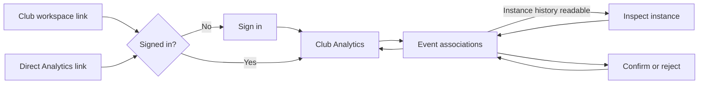

# Event association implementation

Instance detail now offers a deliberate event association to the owner or staff with `manage_events`. The selected event and observed session must belong to the same club and current integration epoch. The confirmed association is shown afterward. Event selection is paginated and uses the shared club event picker query.

The existing confirmed association and event-rollup model is reused. Association does not create a session, alter source observations, infer a closing time or claim named attendance. A session already confirmed for another event cannot be reassigned by submitting a different event. Both manual association and suggestion review require `manage_events`, including confirmation and rejection; `manage_integrations` alone is insufficient.

Q23 is implemented through this deliberate path: after an event-created instance is observed, staff can select its actual instance detail and associate the event. Successful operation results retain their event identifier and destination, but there is no automatic destination-to-session matching in this change. An unobserved instance cannot acquire invented analytics. Broader comparison reports remain candidate scope.

Pending time and world suggestions are reviewed on the club Analytics page by staff with `manage_events` and access to event recaps. The list is private, paginated, and scoped to the current group connection. A valid suggestion can be confirmed or rejected; a stale suggestion can only be rejected. Review updates the list. Staff with instance history access can open the instance and return to the same Analytics context.

Verification: telemetry backend tests cover denied anonymous and integration-only callers, authorized event staff, stale epochs, foreign events, conflicting confirmed associations and recap recomputation. Desktop/mobile Storybook interaction selects an event, associates it and displays the persisted fixture response. Screenshots in `.cache/artifacts/event-association-desktop.png` and `event-association-mobile.png` were visually inspected: no overlap or clipping, population remains prominent. Web typecheck passes. These checks do not prove a hosted authenticated journey or real provider observation.

New exact user-visible utility strings: `Event`, `Select event`, `Associate event`, `Load more events`, `Event: {title}`, `Event associated.`, `Association failed.`. BASIC approved the remaining exact copy on September 16, 2026; see the [release review](release-review.md#copy-status). Later substantive wording changes still need review.
