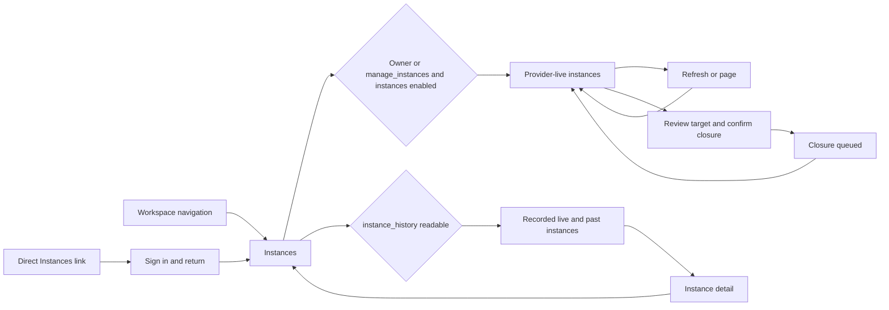

# Durable club operation contract

The operation queue stores explicit provider payloads, the authorizing VRDex
subject, connection epoch, schedule, revision and per-target outcome. Public
`enqueue` freezes up to 100 reviewed payloads atomically. A request ID is unique
within the club and retries return the existing IDs when the actor and content
match. Bulk operations are limited to invitations, request decisions and role
assignments. Bans and removals remain individual actions.

`edit` only changes pending actions. The editor needs the original and new
underlying permissions; editing another person's action additionally requires
`manage_scheduled_actions` unless the editor is the owner. The edit stores the
previous revision and makes the editor the new authorizing subject. `cancel`
also accepts claimed but not submitted actions. The shared paginated list only
returns actions for which the current actor has the underlying permission.

Worker sequence, using the current integration lease and credential:

1. `claim` returns one operation ID, opaque nonce, payload and epoch.
2. Resolve fresh provider own-member evidence and perform target eligibility
   checks. Acquire a provider request budget slot before authorization.
3. `authorizeSubmission` rechecks the lease, nonce, epoch, current staff roles,
   feature setting, provider grants, target protections and provider-role
   allowlists. Success atomically records `submitted` before the single write.
4. `complete` records a bounded result and succeeded, rejected or indeterminate
   status for that exact claim. `rejectClaim` records a definite failure that
   occurred before submission.

An expired claimed action may be reclaimed with a new nonce. An expired
submitted action becomes indeterminate and is never automatically requeued.
When the worker receives authorization but a final budget, deadline, or shutdown
guard prevents invoking provider transport, it completes the action as rejected
with `submission_not_attempted` (displayed as `Not sent`). It does not requeue it.
Once transport is invoked, an uncertain response still becomes indeterminate.
Missing authorization acknowledgement does not establish a definite outcome.
Remaining work more than 15 minutes past its scheduled time becomes missed.
This is a per-target limit, including unsent batch recipients: the accepted
Q31-Q33 decision in the discovery document explicitly says to mark remaining
work missed after the grace window. Starting a batch does not exempt its tail.
Preflight claims last up to four minutes, capped by the active integration
lease. Submitted-write uncertainty remains two minutes. Definite transient
preflight failures may retry at most twice, respecting provider backoff and
the original grace deadline; an ambiguous submitted write cannot enter this
retry path. The indexed `readyAt` field separates retry timing from the original
`dueAt`, so deferred targets cannot hide runnable work behind a bounded scan.
Event-relative work rechecks event cancellation and rebases changed event times
before applying lateness checks. Event writes also trigger bounded fanout, so
jobs moved earlier receive updated queue wakeups immediately.

The event writer trace covers the shared `updateCommunityEventRecord` path
(browser, API and MCP), `setCommunityEventCancelled`, and the local fixture
updater. Calendar import helpers produce import documents rather than updating
the events table. No event deletion endpoint currently exists; the same hook
cancels unsent work if an event is missing, for future deletion integrations.
Media, audit and analytics functions with variables named `event` do not mutate
the events table's schedule or status.

Fanout uses a stable event-only index with 100 rows per page and scheduled
continuations. Rebased claims lose their nonce; authorizing subjects remain
unchanged and are checked again at execution. Cancellation never modifies
submitted or completed artifacts. A cancellation signal remains effective
across continuation pages even if the event is reinstated immediately.

Dependent invitations keep the reviewed `invite_to_created_instance` payload
and selected creation ID unchanged. The invitation review freezes the displayed
creation's revision and sends it with the destination. Enqueue requires that
caller-reviewed revision to match the selected creation and stores it as
`dependencyRevision`. Timing and recipient edits preserve that evidence; they
cannot approve a new creation revision or replace the selected creation. A later
creation edit rejects remaining dependent invitations at claim or final
authorization, even if the creation returns to the same destination. Cancel the
old invitation and use the invitation composer to review and create a new one.
Older pending invitations without caller review evidence or a stored dependency
revision fail closed and require the same cancellation and recreation flow.
Only a succeeded creation in the same integration epoch can supply the concrete destination returned to the worker.
The destination must match the planned world and connected group; failures and
unknown outcomes never substitute another instance. Submission rechecks the
dependency. A linked creation's event association also applies to remaining
invitations, so event cancellation stops them. If a pending creation is edited to a different event or detached from its inherited event, unsent invitations reviewed against the previous association are rejected at claim or final authorization. Their reviewed schedules are never silently rebound.

Current integration work still includes notifications, reusable recipient lists
and scheduled UI. Provider writes are not
verified by backend state-machine tests. These APIs do not bypass provider
transport checks.

## Worker request budgets

The worker authenticates its VRChat user, then reserves one shared account and
integration allowance for the remaining preflight and write. Ordinary writes
need two requests per minute, normal instance closes need three, and instance
invitations need four. Lower effective limits reject the claimed action with
`operation_budget_too_low` before provider reads or budget waits. Limits are
never raised automatically.

The reserved allowance includes the current group grant read, the optional
destination and friendship reads, and exactly one write. Local sliding budgets
charge each actual request. Shared reserved slots remain charged even if
preflight fails, and cannot be reused in another calendar window. A slow
preflight or expired reservation defers unsubmitted work under the existing
bounded retry policy. The worker retains its 30-second evidence check and the
server retains its 60-second authority check. No refresh loop can consume the
reserved write slot. Once final authorization has marked a job submitted, any
subsequent uncertainty remains indeterminate and is never blindly retried.
The claim's `executeBefore` also caps the worker deadline, so an authorization
response that arrives after the action's 15-minute grace cannot start a write,
even when its request-budget reservation has not expired.

## Live instance management

The Instances route exposes provider-live instances inside Instance management
when the actor is the owner or has `manage_instances` and the connection enables
`instances`. The existing `clubProviderReads` request/get path supplies those
rows independently of the analytics feature and `instance_history` visibility.
Refresh, errors and bounded provider pagination use the shared read behavior.

Each row displays the world and instance IDs beside the existing normal-close
confirmation. Confirmation queues the exact displayed destination through
`clubOperations.enqueue`; provider and actor authorization are still rechecked
at execution. Queued closure is not evidence that the provider closed it.

Telemetry-backed live/past lists and detail retain their existing category
checks and peak/average presentation. The management list creates no telemetry
sessions or historical observations.

