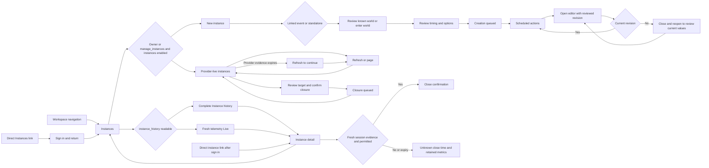

# Durable club operation contract

The operation queue stores explicit provider payloads, the authorizing VRDex
subject, connection epoch, schedule, revision and per-target outcome. Public
`enqueue` freezes up to 100 reviewed payloads atomically. A request ID is unique
within the club and retries return the existing IDs when the actor and content
match. Bulk operations are limited to invitations, request decisions and role
assignments. Bans and removals remain individual actions.

Immediate requests use `schedule: { kind: "immediate", eventId? }`. The enqueue
transaction stores its server time as `dueAt` and `readyAt` once, after checking
request-ID equality. Identical retries return the same IDs and timestamps, even
after the grace window. Changed payloads or schedules under that ID reject.
Fixed timestamps and event-relative offsets retain their existing meanings;
legacy fixed rows remain valid. Editing a pending action to `immediate` records
the previous revision and sets a new server-derived due time. Optional event
association still enforces club ownership and cancellation. Event movement only
rebases event-relative schedules, never a committed immediate due time.

The post composer retains the saved draft revision when retrying unchanged
content and timing after an ambiguous queue response. Queue replay validates the
same schedule through the shared request comparison. Dependent invitations keep
the reviewed creation revision and cannot precede its effective due time;
immediate timing is checked on the server, independent of the browser clock.

`edit` only changes pending actions and requires `expectedRevision`, captured when
the editor opens. A mismatched revision rejects transactionally with `Refresh to
continue.` before executable fields, integration wakeups or revision history
change. Close and reopen the editor to review the current payload and schedule;
reactive queue updates never rebase the stale form. The editor needs the original and new
underlying permissions; editing another person's action additionally requires
`manage_scheduled_actions` unless the editor is the owner. The edit stores the
previous revision and makes the editor the new authorizing subject. `cancel`
also accepts claimed but not submitted actions. The shared paginated list only
returns actions for which the current actor has the underlying permission.

Worker sequence, using the current integration lease and credential:

1. `claim` returns one operation ID, opaque nonce, payload and epoch.
2. Resolve fresh provider own-member evidence and perform target eligibility
   checks. Acquire a provider request budget slot before authorization.
3. `authorizeSubmission` rechecks the lease, nonce, epoch, current staff roles,
   feature setting, provider grants, target protections and provider-role
   allowlists. Success atomically records `submitted` before the single write.
4. `complete` records a bounded result and succeeded, rejected or indeterminate
   status for that exact claim. `rejectClaim` records a definite failure that
   occurred before submission.

Completion records the already-submitted attempt using its stored integration,
epoch, collector account, worker ID, fencing token and nonce. The worker must
still authenticate with that account's current worker key and matching VRChat
identity. The mutation rechecks the current key in its transaction. A disconnect,
new connection epoch, integration/fleet/account kill switch, account quarantine,
reassignment, credential-generation change or expired/replaced lease does not
discard an authenticated result for that exact submitted claim. Its recorded
credential generation remains historical evidence. This exception permits only
terminal completion through disabled-account HTTP admission; claim,
authorization, rejection before submission and deferral retain their existing
execution gates. Completion cannot authorize another provider write.
The exception covers every disabled account state, including provisioning,
degraded, cooldown, auth_required, quarantined, retiring and retired. A replacement
worker key can report the original exact claim; the superseded key cannot.

Authorization schedules recovery at the claim's existing two-minute submission
expiry. The internal callback checks the submitted state, nonce and exact expiry
before recording `indeterminate` with `submission_outcome_unknown`. Recovery
runs independently of account or connection health and never requeues the write.
Revoked worker keys remain unauthorized. If the result cannot be authenticated,
the scheduled callback records uncertainty without guessing the provider outcome.
A result arriving while the exact claim is still submitted may be recorded even
after its lease or claim expiry. Once completion or expiry recovery has recorded
a terminal state, duplicate and late results cannot overwrite it.

Submissions authorized before scheduled recovery was deployed have no callback.
Their existing claim-time expiry sweep remains available when collection resumes;
disconnected legacy rows need an operator to invoke the same guarded recovery
with the stored operation ID, nonce and expiry. No legacy row is automatically
replayed or declared successful.

An expired claimed action may be reclaimed with a new nonce. An expired
submitted action becomes indeterminate and is never automatically requeued.
When the worker receives authorization but a final budget, deadline, or shutdown
guard prevents invoking provider transport, it completes the action as rejected
with `submission_not_attempted` (displayed as `Not sent`). It does not requeue it.
Once transport is invoked, an uncertain response still becomes indeterminate.
Missing authorization acknowledgement does not establish a definite outcome.
Remaining work more than 15 minutes past its scheduled time becomes missed.
This is a per-target limit, including unsent batch recipients: the accepted
Q31-Q33 decision in the discovery document explicitly says to mark remaining
work missed after the grace window. Starting a batch does not exempt its tail.
Preflight claims last up to four minutes, capped by the active integration
lease. Submitted-write uncertainty remains two minutes. Definite transient
preflight failures may retry at most twice, respecting provider backoff and
the original grace deadline; an ambiguous submitted write cannot enter this
retry path. The indexed `readyAt` field separates retry timing from the original
`dueAt`, so deferred targets cannot hide runnable work behind a bounded scan.
Event-relative work rechecks event cancellation and rebases changed event times
before applying lateness checks. Event writes also trigger bounded fanout, so
jobs moved earlier receive updated queue wakeups immediately.

The event writer trace covers the shared `updateCommunityEventRecord` path
(browser, API and MCP), `setCommunityEventCancelled`, and the local fixture
updater. Calendar import helpers produce import documents rather than updating
the events table. No event deletion endpoint currently exists; the same hook
cancels unsent work if an event is missing, for future deletion integrations.
Media, audit and analytics functions with variables named `event` do not mutate
the events table's schedule or status.

Fanout uses a stable event-only index with 100 rows per page and scheduled
continuations. Rebased claims lose their nonce; authorizing subjects remain
unchanged and are checked again at execution. Cancellation never modifies
submitted or completed artifacts. A cancellation signal remains effective
across continuation pages even if the event is reinstated immediately.

Dependent invitations keep the reviewed `invite_to_created_instance` payload
and selected creation ID unchanged. The invitation review freezes the displayed
creation's revision and sends it with the destination. Enqueue requires that
caller-reviewed revision to match the selected creation and stores it as
`dependencyRevision`. Timing and recipient edits preserve that evidence; they
cannot approve a new creation revision or replace the selected creation. A later
creation edit rejects remaining dependent invitations at claim or final
authorization, even if the creation returns to the same destination. Cancel the
old invitation and use the invitation composer to review and create a new one.
Older pending invitations without caller review evidence or a stored dependency
revision fail closed and require the same cancellation and recreation flow.
Only a succeeded creation in the same integration epoch can supply the concrete destination returned to the worker.
The destination must match the planned world and connected group; failures and
unknown outcomes never substitute another instance. Submission rechecks the
dependency. A linked creation's event association also applies to remaining
invitations, so event cancellation stops them. If a pending creation is edited to a different event or detached from its inherited event, unsent invitations reviewed against the previous association are rejected at claim or final authorization. Their reviewed schedules are never silently rebound.

Current integration work still includes notifications, reusable recipient lists
and scheduled UI. Provider writes are not
verified by backend state-machine tests. These APIs do not bypass provider
transport checks.

## Independent collection phases

After membership connection or recovery, the collector uses the effective active
state to dispatch operations and provider reads before optional analytics.
Readiness refresh runs even when aggregate collection or ingest fails. It follows
the aggregate reservation when analytics is enabled, preserving aggregate polls
at the two-request minimum budget. Shared authentication, rate-limit and
membership faults stop the pass before another provider read. Assignments without `analytics` skip aggregate reads, ingest and
membership history even on their first successful connection. Missing feature
settings retain legacy analytics collection. Waiting membership and disconnect
transitions keep their lifecycle behavior.

The authenticated worker failure message accepts optional `telemetryOnly`.
Only aggregate/history phase failures may set it, excluding authentication,
rate limits and membership loss. The backend independently enforces those
exclusions and requires an active integration with another enabled feature.
Such failures still increment failure evidence and transition analytics coverage,
but do not degrade the connection or set its backoff. The next management pass
remains due within one minute. Coverage and last successful observation continue
to expose stale/unknown analytics despite the active management connection.
Management wrappers record the operation or read outcome before propagating a
rate-limit or membership-loss stop to the collector. The existing failure path
then records connection backoff using the provider's retry interval. A submitted
operation result stays recorded and is never replayed by this propagation.
Provider status and retry timing travel only in local helper results; read
completion strips them before sending its strict control-plane payload. Fresh,
correctly scoped inactive membership is distinct from missing operation-specific
permissions, so a permission-only rejection still permits independent features.
Ordinary connection failures and shared throttling/authentication retain their
existing lifecycle/backoff handling. Local/shared budgets, stopping, lease
fencing and execution-time human/provider authorization remain mandatory.

## Worker request budgets

The worker authenticates its VRChat user, then reserves one shared account and
integration allowance for the remaining preflight and write. Ordinary writes
need two requests per minute, normal instance closes need three, and instance
invitations need four. Lower effective limits reject the claimed action with
`operation_budget_too_low` before provider reads or budget waits. Limits are
never raised automatically.

The reserved allowance includes the current group grant read, the optional
destination and friendship reads, and exactly one write. Local sliding budgets
charge each actual request. Shared reserved slots remain charged even if
preflight fails, and cannot be reused in another calendar window. A slow
preflight or expired reservation defers unsubmitted work under the existing
bounded retry policy. The worker retains its 30-second evidence check and the
server retains its 60-second authority check. No refresh loop can consume the
reserved write slot. Once final authorization has marked a job submitted, any
subsequent uncertainty remains indeterminate and is never blindly retried.
The claim's `executeBefore` also caps the worker deadline, so an authorization
response that arrives after the action's 15-minute grace cannot start a write,
even when its request-budget reservation has not expired.

## Live instance management

The Instances route exposes provider-live instances inside Instance management
when the actor is the owner or has `manage_instances` and the connection enables
`instances`. The existing `clubProviderReads` request/get path supplies those
rows independently of the analytics feature and `instance_history` visibility.
Refresh, errors and bounded provider pagination use the shared read behavior.

Provider rows, their closure confirmations and the next-page cursor are available only while the existing provider-read hook reports fresh evidence. At the separate 60-second provider-read expiry, retained data displays Refresh to continue and keeps Refresh instances available. Stale rows unmount, including an already-open confirmation. A new read restores eligible rows without restoring the prior confirmation. Analytics-disabled owners and management-only staff retain this independent path.

Each row displays the world and instance IDs beside the existing normal-close
confirmation. Confirmation queues the exact displayed destination through
`clubOperations.enqueue`; provider and actor authorization are still rechecked
at execution. Queued closure is not evidence that the provider closed it.

For event-linked creation, the authorized paginated event picker adds only a
nullable `vrchatWorldId`. It reads at most 21 event-world links per event; more
than 20 links is treated as ambiguous. Exactly one confirmed link with a valid
VRChat world ID prefills the existing editable world field. Missing, unconfirmed,
ambiguous or invalid world data yields no prefill. Switching events replaces or
clears the previous event-derived value. A deliberate staff edit takes precedence
across later event changes, including standalone selection. Event-relative timing
still uses the selected event start plus the reviewed offset, with the existing
minus-30-minute initial offset; event selection does not change the timing mode.
Creation linkage remains separate from manual observed-session association.

Telemetry-backed Live and complete Instance history lists retain their category checks and peak/average hierarchy. Home Recent instances also uses complete history. Fresh sessions may appear in both lists. Direct detail and list rows require current per-session evidence for Still open and for telemetry-detail closure. Mounted expiry changes unconfirmed closure to Unknown and removes an open confirmation while retaining metrics and navigation. The management list creates no telemetry sessions or historical observations.

## Independent unsent deadlines

Finite nonnegative preflight retry delays are accepted even above the 15-minute action grace. The mutation compares the full provider delay with remaining grace before deriving a retry timestamp, so extreme finite delays safely settle as missed rather than overflowing or shortening backoff. A delay beyond grace records `missed/late_window_elapsed`, clears the exact claim and emits one existing deduplicated terminal notice. An exact-deadline retry remains eligible. The real operation wrapper carries the original provider Retry-After to collector failure recording, which stops further provider work for a shared 429. Submitted work is never deferred or replayed.

Batch invitation cancellation resolves the current actor once in its mutation and passes each already-loaded current job to the shared cancellation helper. The helper checks expected community equality and current payload/original-actor edit permissions before cancellation. Single-operation cancellation still loads the current job and actor once. Pending and claimed targets cancel together or the whole transaction rolls back; submitted targets remain submitted. Cancelled targets create no failure notices. The regression measures bounded authority lookup at 100 recipients and 100 staff roles; it does not claim a reproduced hosted transaction-limit failure.

Two Convex crons start a scan every minute, separately for `pending` and `claimed` work. Each transaction reads at most 100 rows in immutable creation order and schedules its cursor continuation immediately. A scan fixes its creation-time cutoff so newly enqueued work cannot prolong it indefinitely. Future jobs cannot starve an overdue tail. The same path covers existing rows after deployment; no live migration or per-row callback backfill is required.

Each visited row rechecks its current event and due time. Missing, foreign or cancelled events cancel unsent work. Event-relative work uses the current event start plus offset even before an event-rebase continuation reaches it. A changed future due time clears an obsolete claim. Revision-aware immediate/fixed/event-relative edits need no callback re-arming because each scan reads the current row. Only `now > current dueAt + 15 minutes` becomes `missed`, with `late_window_elapsed` and the existing operation/revision/outcome notification dedupe. Exact-boundary work remains eligible.

The scan needs no healthy integration, collector account, worker key, lease or poll. It never authorizes a provider write. Submitted rows and rows carrying a submission marker are excluded; exact-claim two-minute indeterminate recovery remains separate. Convex transaction serialization prevents a submission and expiry from both winning. Terminal rows are not revisited. Timing is eventual: normally the next one-minute scan, plus scheduler/continuation delay under load. There is no hard one-minute completion SLA for an arbitrarily large backlog.
