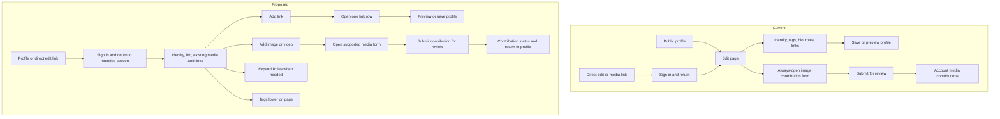

# Profile editor progressive disclosure

Status: candidate direction, documentation only. No profile editor code change.

## Observations

The supplied screenshot of `/nyakuma/edit` shows an always-open empty image form:
file, source URL, credit, credit URL, public label, alt text and reviewer note.
`Media contributions` appears above the form and again below it. Source inspection
shows the second occurrence is an account-history link, not a second heading.
The live URL could not be read by the web tool on 2026-09-28; these observations
come from the screenshot and this branch's code, not an authenticated live audit.

`profile-edit-form.tsx` renders editable profile fields, Save/Preview/Cancel, then
media contributions for eligible community submitters when enabled. Sign-in
preserves the return path and `?section=media#media-contributions`. Profile saving
and media submission are separate: media submit goes to `/account/media-contributions`.
`profile-fields.tsx` places Tags near the top, before headline/bio, then region,
timezone, roles and links. Roles are expanded. Links already has an Add link action
that adds a row, with role-dependent stream inputs handled separately.
The contribution file control currently accepts images, not video.

## Proposed next slice

Keep identity and bio prominent. Put existing media and links near discoverable
`Add image or video` and `Add link` actions. Open the corresponding form only after
the action; allow cancel without losing the main profile edit. Preserve direct
media entry by opening and focusing the disclosure after authentication. Reuse the
existing Add link behavior rather than creating another link workflow.

Place Roles in an accordion with a short summary of selected roles. Preserve
role-dependent stream values when collapsed. Move Tags below core profile content.
Keep one media heading; give the account-history destination a distinct label.
These are proposals, not approved implementation or exact public copy.

## Product and copy questions

- Does video mean a hosted video link, file upload or both? The proposed action
  must not advertise video before its supported path exists.
- Approve the exact `Add image or video` label and a distinct history label,
  such as `View submissions`, before shipping.
- Should media submission return to contribution status, the editor or the profile?
  Preserve unsaved profile edits whichever destination is chosen.
- Should the Roles summary use selected labels or only a count? Keep required
  credit, source and accessibility fields clear when the media form opens.
