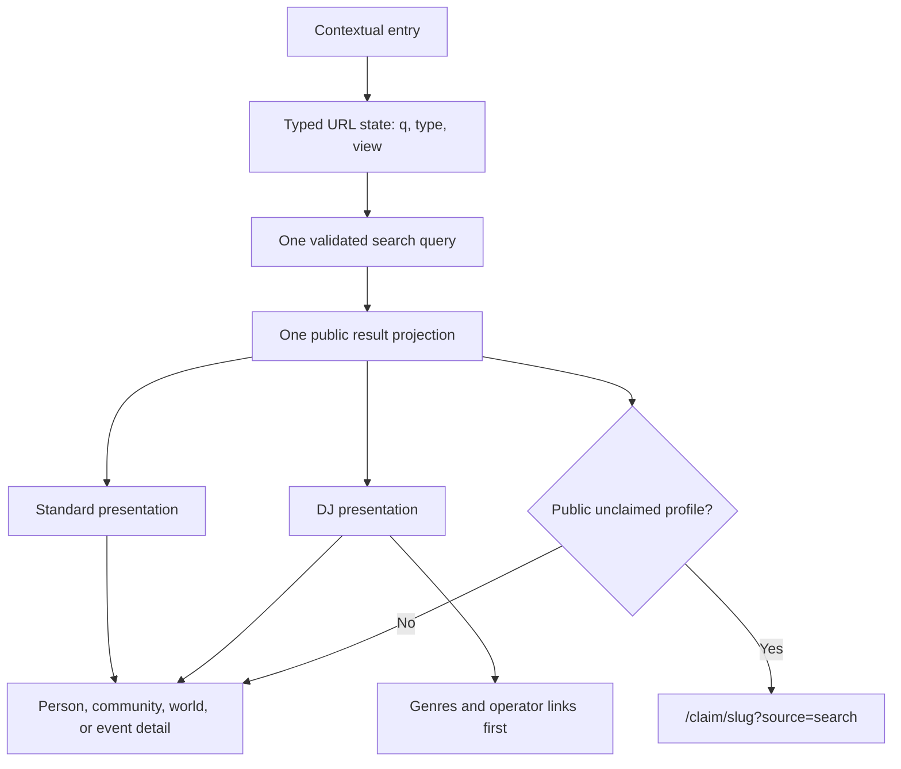

# Unified Search Views

## Status

Current recommendation from the July 25, 2026 repository, production, and
independent Fable review.

This document defines how VRDex should unify public search and DJ Lookup without
turning a useful DJ workflow into the product's permanent taxonomy.

## Verified Current Behavior

- Before this slice, `/search` queried public `searchDocuments` across profiles,
  worlds, and events, then applied `type=person|community|world|event` in the
  client over the first 24 results. The unified implementation sends those
  closed filters to the backend.
- `/` and `/lookup` render the same person-only lookup component. The UI is
  DJ-oriented, with genres and operator links foregrounded, but the query does
  not require a DJ role. It searches every public person profile.
- DJ Lookup owns the stronger interaction pattern: cancellable look-ahead,
  recent searches, public/private seed deduplication, and bulk lookup.
- `profiles.person.roleTags` is a flexible, visibility-controlled role field.
  `DJ` is not a verified credential. Role terms can be seeded, user-created,
  reviewed, or imported, while claim and source trust currently apply at the
  profile level rather than to an individual role assertion.
- Search documents already include normalized `person_role:*` vocabulary keys,
  but Convex cannot use array membership as an exact search-index filter.
- Production matches the repository behavior. A live `DJ` search returns the
  first bounded set of person results; DJ Lookup presents the same records with
  DJ/operator links and private seed results when the viewer has access.
- `BASICBIT` is the canonical rich acceptance record. The repository already
  has a public fixture plus a private seed candidate and deduplication coverage.

## Locked Decisions

- One public search architecture serves generic and purpose-specific journeys.
- Public URL state stays understandable and shareable. Public URLs accept named
  view keys and typed filters, not an executable or user-authored DSL.
- Purpose-specific views may change eligible entity types, presentation, link
  priority, copy, and default sorting. They must not fork result data or search
  behavior into a second product.
- Self-declared or imported roles must not be presented as verified roles.
- Public surfacing, field visibility, suppression, and private-seed access
  rules remain enforced by the existing backend.
- The separate claim task owns `/claim/[slug]`, its route helper, and all claim
  states. Search may only consume that helper for eligible public unclaimed
  profiles with the bounded source value `search`.

## Architecture Decision

### Current recommendation: typed filters plus typed built-in presets

Adopt a small `SearchViewPreset` registry in TypeScript. The first two views are:

| View | Entity scope | Presentation | Stable URL |
| --- | --- | --- | --- |
| Standard | Profiles, worlds, events | Generic entity results | `/search?q=...` |
| DJ | People | Genres and DJ/operator links first; bulk mode available | `/search?q=...&view=dj` |

`/lookup` remains a compatible entry point for the DJ view. `/` may keep the
same current entry experience until homepage direction is reopened.

The first implementation does not make DJ an index-enforced eligibility rule.
That would imply stronger taxonomy semantics than VRDex currently has. The DJ
view may foreground records with a visible DJ role term and keep exact name
matches useful, but it must label the role as profile-provided data rather than
verification.

### Deferred: stored declarative views

Consider stored, versioned, schema-validated view definitions only after at
least three real presets need materially different configuration or moderators
must change views without a deploy. Named `view=<key>` URLs and the typed preset
shape provide the migration seam.

### Rejected: public search DSL

A composable public DSL has no verified requirement. It would add validation,
denial-of-service, compatibility, and URL-comprehension costs without improving
the current standard and DJ journeys. If external API consumers later need
arbitrary composition, design that separately in the public API contract.

## Information Architecture



### Default journey

1. A generic entry opens standard search.
2. A DJ/operator entry opens the named DJ view directly.
3. The active view is visible and removable; leaving it preserves the query.
4. Look-ahead uses the same query and result projection as submitted results.
5. Enter opens the selected suggestion. Escape closes suggestions. Arrow keys
   move through visible options.
6. Submitting writes stable URL state so refresh, back, forward, and sharing
   preserve the journey.
7. DJ bulk input remains a purpose-specific, session-local capability. It does
   not serialize pasted lineups into a public URL.

## Role And Trust Semantics

Current recommendation:

- Keep role identity in `person.roleTags` and the scoped `person_role`
  vocabulary.
- Treat "I want to be discoverable as..." as an owner-editable public role field,
  not a verified credential or booking-availability claim.
- Keep availability, booking state, and permission capabilities separate.
- Use existing vocabulary aliases for obvious synonyms after review; do not
  implement language inference or silent canonical merges.
- Preserve profile and field provenance in results. A profile may be
  owner-authored, imported, moderator-curated, or community-submitted, while a
  role remains profile-provided unless a future field-level attestation model
  says otherwise.

Owner decision before index or data migration:

- which normalized role keys qualify for strict DJ eligibility;
- whether owner-authored, imported, and moderator-curated roles have different
  filtering or labeling semantics;
- moderation and alias-merge policy for user-created role terms;
- whether "discoverable as" later needs availability or booking semantics.

## Query And Validation Contract

Candidate public state:

```ts
type SearchViewKey = "standard" | "dj";
type SearchEntityFilter = "all" | "person" | "community" | "world" | "event";

type PublicSearchState = {
  query: string;
  view: SearchViewKey;
  entityType: SearchEntityFilter;
};
```

- Trim and bound `query` with the existing normalization contract.
- Parse `view` and `type` through closed allowlists.
- Let a preset narrow allowed filters; never accept arbitrary field names,
  operators, sort expressions, or executable configuration.
- Bound result and suggestion counts server-side.
- Keep private seed suggestions restricted to the DJ/operator surface and the
  existing viewer grant plus feature flag.

## Presentation Contract

A single public result projection should carry:

- canonical entity identity and route;
- entity/profile type;
- display name, public media choice, summary, and source/trust label;
- person-only public genres, role terms, and outbound links when needed by the
  selected view;
- a derived claim-entry eligibility state for public unclaimed profiles.

Presentation presets decide which fields are prominent. They do not refetch a
second representation of the same public entity.

`BASICBIT` acceptance:

- `BASICBIT` and `basicbit` resolve case-insensitively;
- supported search aliases resolve to the same canonical public result;
- a matching private seed candidate deduplicates against the public profile
  when canonical slug or shared normalized link evidence matches;
- public display remains exactly `BASICBIT`;
- the reviewed public profile image is selected consistently;
- standard and DJ presentations agree on identity, media, source, trust, and
  canonical route;
- DJ presentation foregrounds relevant public genres and operator links.

Sparse imported acceptance:

- missing avatar uses the shared entity fallback;
- missing genres or links do not create empty chrome or runtime errors;
- imported provenance remains visible;
- the standard card stays useful without DJ-specific fields.

## Telemetry

Keep events bounded and free of raw query or private profile data:

- view key;
- entity filter;
- result count bucket;
- selected entity type/profile type;
- entry surface;
- suggestion versus submitted-result selection;
- empty/error outcome.

Do not emit private seed names, links, raw query text, or stable user/profile
identifiers merely to measure the search funnel.

## First Implementation Slice

1. Add typed view and URL-state parsing.
2. Make backend filters authoritative rather than filtering only a truncated
   result page in the browser.
3. Use one public result projection for generic and DJ presentations.
4. Generalize DJ Lookup look-ahead into an accessible search combobox.
5. Express DJ Lookup as the built-in DJ view and preserve `/lookup`.
6. Add the narrow `/claim/<slug>?source=search` affordance only for eligible
   public unclaimed profiles.
7. Cover ranking, filtering, view parsing, deduplication, `BASICBIT`, sparse
   fallbacks, keyboard behavior, URL history, and responsive visuals.

## Explicitly Deferred

- search-document schema or index migrations for role membership;
- vocabulary merges or production role/tag mutation;
- stored or user-authored views;
- saved personal searches;
- role verification or field-level attestations;
- booking availability/capability modeling;
- semantic/vector provider activation;
- private seed results in standard public search;
- arbitrary facet counts across the complete result corpus.
