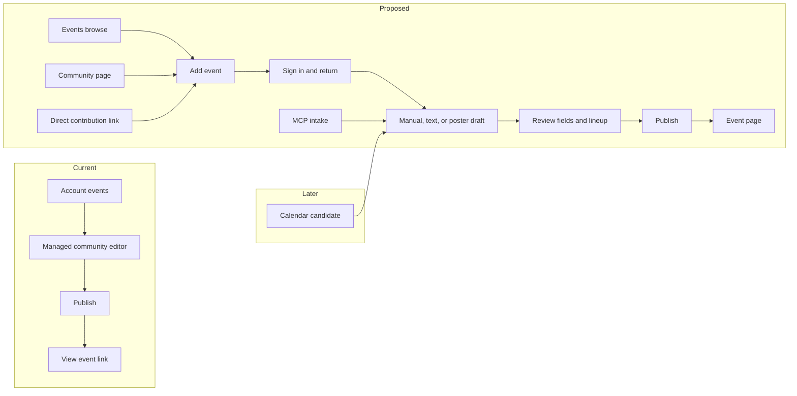

# Community Event Contribution and AI Intake Implementation Plan

> **For agentic workers:** REQUIRED SUB-SKILL: Use superpowers:subagent-driven-development (recommended) or superpowers:executing-plans to implement this plan task-by-task. Steps use checkbox (`- [ ]`) syntax for tracking.

**Goal:** Let any signed-in account create a useful event for any public community through manual, text, or poster intake, publish it immediately after preflight, and show a clean public lineup and DJ-link sheet.

**Architecture:** A partial, private intake draft is shared by browser, API, and MCP adapters. Convex owns authorization, versioned drafts, publication, correction, and public projections; a bounded server-side agent only proposes fields. Preserve current staff event controls and timed playback while adding date-only schedules and untimed lineup entries.

**Tech Stack:** Next.js, TypeScript, Convex, `@vrdex/api-contracts`, hosted and local VRDex MCP, OpenAI Responses, existing S3 upload infrastructure, Node tests, convex-test, Playwright.

**Spec:** [Approved event contribution and AI intake design](../specs/2026-09-25-event-contribution-ai-intake-design.md). Read its two linked research notes before Task 6.

## Global Constraints

- Planning baseline: `7f2d65321`. Recheck the implementation branch against current `main` before changing code. Keep one cohesive PR with task-level commits.
- Any signed-in account can contribute for any public community. Do not add a verified-email requirement or a community acceptance queue.
- Public minimum: a public community, identifying title, and calendar date. A date-only event has time TBA and no public start instant; unknown-date work remains private.
- Browser and MCP use the same typed intake and server preflight. Contributor publication uses a new `events:contribute` scope, never owner/staff `events:write` authority.
- The agent has read-only people/community/time tools, returns tentative structured fields, and never publishes or selects a stream. Manual intake works without an AI key.
- Source posters remain private unless a separate, explicit artwork action succeeds. Do not fetch arbitrary remote poster URLs in this slice.
- Contributors may make scoped self-edits until staff edit or takeover. Staff may correct or remove immediately; moderator removal is separate and audited.
- Keep live watch contextual and inactive for date-only events. Do not regress owner event creation, timed slots, or playback.
- `Slots` is the editor label; `Lineup` is the public section. Public lineup rows show images and omit per-performer link dumps and a separate Participants section. VRCDN/Twitch links live in a collapsed bottom accordion.
- Exact new public sentences need BASIC's review before shipping. Public copy has no em dash. UI work needs desktop/mobile screenshots and visual review.
- Do not run paid model fixtures, production migrations, or hosted writes merely because this plan exists. Record provider configuration names, scope, owner, and recreation steps in checked-in docs.

## Review Focus

- A date-only event on a viewer's timezone boundary keeps its authored date, exports `VALUE=DATE` with time TBA, and never starts watch (Task 1 test).
- Two clients publishing the same draft concurrently yield one event and the same receipt; changing the payload under a reused key conflicts (Task 3 test).
- A staff takeover racing a contributor edit rejects the stale contributor version without reverting staff fields (Task 4 test).
- Searching `EST` for a July event offers a canonical Eastern zone with its daylight-saving offset, not a silently stored fixed abbreviation (Task 5 test).
- A poster instructing the model to publish or invent a person remains data; the returned ID must come from a lookup and a human must publish (Task 6 test).

---

## Delivery and file map

All paths are repository-relative. Create paths are proposed files. Work in one implementation branch and one PR; the checkpoints below are local proof points, not separate releases.

| Responsibility | Modify | Create |
| --- | --- | --- |
| Schedule domain, indexes, public contracts and exports | `convex/schema.ts`, `convex/events.ts`, `convex/_eventPublic.ts`, `convex/_searchDocuments.ts`, `convex/_eventDiscordExport.ts`, `packages/api-contracts/src/schemas.ts`, `apps/web/src/lib/calendar/ics.ts`, event card/time components | `convex/_eventSchedule.ts`, `convex/eventScheduleMigration.ts` |
| Unified lineup storage/projection | `convex/schema.ts`, `convex/_eventInputs.ts`, `convex/_eventPublic.ts`, `convex/events.ts`, `packages/api-contracts/src/schemas.ts` | `convex/_eventLineup.ts` |
| Partial drafts and publication | `convex/schema.ts`, `convex/events.ts`, `convex/_eventPublic.ts`, `convex/_searchDocuments.ts` | `convex/eventIntake.ts`, `convex/_eventIntake.ts`, `convex/_eventContributionPreflight.ts`, `packages/api-contracts/src/event-intake.ts` |
| Self-edits, reports, removal | `convex/schema.ts`, `convex/events.ts`, public queries/search, `convex/_eventContributionPreflight.ts` | `convex/eventCorrections.ts` |
| Browser editor and public layout | `apps/web/src/app/events/new/page.tsx`, `apps/web/src/app/events/event-editor-form.tsx`, `apps/web/src/app/_components/event-public-page.tsx`, `apps/web/src/app/_components/profile-public-page.tsx`, `apps/web/src/app/_components/discovery-public-page.tsx`, `apps/web/src/app/account/events/managed-events-panel.tsx` | `apps/web/src/app/events/event-intake-form.tsx`, `apps/web/src/app/_components/event-timezone-picker.tsx`, `apps/web/src/lib/event-timezones.ts`, `apps/web/src/app/_components/event-dj-links.tsx` |
| Private poster and agent | `convex/schema.ts`, `convex/crons.ts`, `apps/web/.env.example` | `convex/eventIntakeSources.ts`, `apps/web/src/lib/server/event-poster-storage.ts`, `apps/web/src/lib/server/event-intake-agent.ts`, `apps/web/src/lib/server/event-intake-spam.ts` |
| API/MCP adapters and scopes | `packages/api-contracts/src/auth.ts`, `packages/api-contracts/src/oauth.ts`, `packages/api-contracts/src/schemas.ts`, `packages/api-contracts/src/openapi.ts`, `convex/_apiTokens.ts`, `convex/apiTokens.ts`, `convex/_oauth.ts`, `apps/web/src/lib/oauth-consent-copy.ts`, `apps/web/src/app/developers/tokens/developer-tokens-panel.tsx`, `apps/web/src/lib/server/vrdex-mcp.ts`, `packages/vrdex-mcp/src/server.ts` | `apps/web/src/lib/server/event-intake-api.ts`, `apps/web/src/app/api/v0/event-intake/route.ts`, `apps/web/src/app/api/v0/event-intake/[draftId]/route.ts`, `apps/web/src/app/api/v0/event-intake/[draftId]/publish/route.ts`, `apps/web/src/app/api/v0/event-intake/[draftId]/extract/route.ts`, `apps/web/src/app/api/v0/event-intake/[draftId]/poster-upload/begin/route.ts`, `apps/web/src/app/api/v0/event-intake/[draftId]/poster-upload/complete/route.ts`, `apps/web/src/app/api/v0/event-intake/[draftId]/artwork/route.ts`, `apps/web/src/app/api/v0/events/[slug]/contribution/route.ts`, `apps/web/src/app/api/v0/events/[slug]/report/route.ts` |

Use `EventIntakeDraftInput` from `packages/api-contracts/src/event-intake.ts` as the wire shape. It has optional `communitySlug`, `title`, `schedule` (`{kind:"date_only", date}` or `{kind:"timed", date, localStart, localEnd?, timeZone}`), `summary`, `venueLabel`, `sourceUrl`, `worldSlug`, and ordered `lineup[]` entries (`clientKey`, `performerLabel`, optional `personSlug`, `roleLabel`, local times). Draft updates distinguish omitted (unchanged), `null` (clear), and empty string (unknown); a lineup update replaces the whole bounded array. Server-owned metadata includes actor, `version`, tentative extraction/evidence, source asset, publication state, and receipt. API schemas reject unknown authority and live-control fields.

## Task 1: Date-only schedule foundation

**Files:** Create `convex/_eventSchedule.ts`, `convex/eventScheduleMigration.ts`, `tests/backend/event-schedule.test.ts`; modify schedule/index consumers in the file map, `tests/backend/event-foundation.test.ts`, `tests/backend/event-discord-export.test.ts`, `tests/web/calendar-timezone.test.ts`, and `packages/api-contracts/tests/event-lineup.test.ts`.

**Interfaces:** Produce `EventSchedule = {kind:"timed"; startAt:number; date:string; timeZone?:string} | {kind:"date_only"; date:string}` and `normalizeEventSchedule(input: EventSchedule): {startAt?:number; eventDate:string; scheduleKind:"timed"|"date_only"; sortAt:number}` in `convex/_eventSchedule.ts`. Optional `timeZone` allows legacy timed rows; new timed publication still requires a selected zone. Existing events without `scheduleKind` read as timed. `sortAt` is index-only and is never exposed as a start instant.

- [ ] Write failing schedule and contract tests: timed legacy rows still round-trip; date-only `2026-07-04` stays July 4 for viewers in UTC-12 and UTC+14; ICS uses `DTSTART;VALUE=DATE:20260704` and says time TBA; watch and Discord timestamp paths omit exact-time controls; search/community/upcoming lists include the row in date order.
- [ ] Run `node --conditions=import --import tsx --test tests/backend/event-schedule.test.ts tests/backend/event-foundation.test.ts tests/backend/event-discord-export.test.ts` and `pnpm test:api-contracts`; confirm the new cases fail.
- [ ] Add `scheduleKind`, `eventDate`, and indexed `sortAt` to `events`, allowing legacy `startAt` until migration. Implement `normalizeEventSchedule` and a bounded, resumable backfill for old timed rows. New date-only rows omit `startAt`; do not create a midnight timestamp. Add a deployment switch so date-only writes wait until backfill and new indexes are ready.
- [ ] Update public projections, API schemas/OpenAPI, search, community/person event queries, cards, ICS, Discord export, and watch selection to branch on schedule kind. Keep timed results compatible; date-only public JSON carries `eventDate` and no `startAt`/Discord instant.
- [ ] Run the focused tests, `pnpm typecheck:backend`, `pnpm typecheck:web`, and `pnpm check:api-openapi`; expect passes. Commit as `feat: represent date-only events without a start instant`.

## Task 2: Unified public lineup

**Files:** Create `convex/_eventLineup.ts`, `tests/backend/event-lineup-projection.test.ts`, `tests/web/event-dj-links.test.ts`; modify `convex/schema.ts`, `convex/_eventInputs.ts`, `convex/_eventPublic.ts`, `convex/events.ts`, `packages/api-contracts/src/schemas.ts`, `apps/web/src/app/_components/event-public-page.tsx`, and `tests/web/event-performer-links.test.ts`.

**Interfaces:** Produce `EventLineupInput = {clientKey:string; position:number; performerLabel:string; personSlug?:string; roleLabel?:string; startAt?:number; endAt?:number}[]` and `replaceEventLineup(db, event, entries, now): Promise<void>`. Timed rows continue to populate `eventSlots` for playback; matched people continue to populate `eventParticipants` for person-event discovery. Add `eventLineupEntries` indexed by event and position for untimed entries, with optional matched person. Public `lineup[]` merges all three sources, dedupes a participant already represented by a slot/entry, and keeps multiple real sets.

- [ ] Write failing backend/contract tests for ordered unmatched names, untimed matched people, image projection, duplicate participant suppression, two real sets by one DJ, legacy participant-only events, and links deduped by provider/target. Verify an unmatched timed slot remains visible.
- [ ] Run `node --conditions=import --import tsx --test tests/backend/event-lineup-projection.test.ts` and `pnpm test:api-contracts`; confirm the new cases fail.
- [ ] Implement the shared lineup validator/write adapter and public `lineup[]`. Keep current slot and participant association indexes and selected-stream behavior. Never infer an identity from a text label; resolve `personSlug` against a published public person on write.
- [ ] Render one `Lineup` section with the existing `EntityImage` treatment and local times. Remove per-row `EventPerformerLinks` and the separate Participants card. Create `event-dj-links.tsx` to group unique VRCDN/Twitch targets per performer in a collapsed bottom accordion; preserve contextual watch and ordinary event reference links.
- [ ] Run backend/contract tests, `pnpm typecheck:web`, and event lineup snapshot tests. Inspect desktop/mobile screenshots before accepting new baselines. Commit as `feat: unify event lineup and move DJ links`.

## Task 3: Shared partial drafts and immediate publication

**Files:** Create `packages/api-contracts/src/event-intake.ts`, `convex/_eventIntake.ts`, `convex/_eventContributionPreflight.ts`, `convex/eventIntake.ts`, `tests/backend/event-intake.test.ts`, `packages/api-contracts/tests/event-intake.test.ts`; modify `convex/schema.ts`, `convex/crons.ts`, `convex/events.ts`, `convex/_eventPublic.ts`, and `convex/_searchDocuments.ts`.

**Interfaces:** Produce `saveEventIntakeDraft({draftId?, expectedVersion?, patch}): {draftId, version}`, `getEventIntakeDraft({draftId})`, and `publishEventIntake({draftId, expectedVersion, idempotencyKey}): {eventPath, eventId, receiptId}` for authenticated browser users, plus internal actor-bound equivalents for API/MCP. `publishEventIntake` is an action that may run Task 6's classifier, then calls internal `commitPublishIntake` mutation. That mutation rechecks version and deterministic preflight and atomically writes the event and receipt. All paths call `sanitizeEventIntakePatch` and `publishIntakeDraft` in `convex/_eventIntake.ts`; no client-selected actor is trusted.

- [ ] Write failing tests for a poster-only draft, one meaningful-field minimum, omitted/null/empty patch semantics, version conflict, unknown-date publication refusal, date-only publication with no source URL, arbitrary public community, private community refusal, an ordinary signed-in user without verified email or staff authority, exact duplicate replay, near-duplicate warning, and two concurrent publishes yielding one canonical event/receipt. Reused idempotency key with changed input must conflict.
- [ ] Run `node --conditions=import --import tsx --test tests/backend/event-intake.test.ts` and `pnpm test:api-contracts`; confirm the new cases fail.
- [ ] Add private `eventIntakeDrafts` and `eventContributionReceipts` with actor/version indexes. Implement bounded draft storage, field provenance, current-version compare-and-swap, and an intake-to-canonical adapter. Expire abandoned drafts with a bounded scheduled sweep; retain immutable publish receipts. Resolve local lineup times with Task 1's schedule helper, including explicit DST choice and cross-midnight intent. Add `venueLabel` to canonical/public event fields and `contributor` to internal/public source enums; keep contributor identity and source evidence separate from owner confirmation, and atomically index a passing published event.
- [ ] Implement deterministic preflight in `convex/_eventContributionPreflight.ts`: title/date/target, URL and text bounds, account/target quotas, duplicate/repost fingerprint, and live-control field exclusion. A near match returns choices for the contributor to review; an exact replay returns the existing event. No staff acceptance state or verified-email check.
- [ ] Run backend/contracts suites and both typechecks; verify a published event is reachable via existing public query, search, and community list. Commit as `feat: publish contributed events from partial drafts`.

## Task 4: Scoped correction, reporting, and removal

**Files:** Create `convex/eventCorrections.ts`, `tests/backend/event-corrections.test.ts`; modify `convex/schema.ts`, `convex/events.ts`, public event reads/search, and `convex/_eventContributionPreflight.ts`.

**Interfaces:** Produce `updateOwnContributedEvent({eventId, expectedUpdatedAt, patch})`, `retractOwnContributedEvent({eventId})`, `reportEvent({eventId, reason})`, `listEventReports({cursor, limit})`, `takeOverContributedEvent({eventId})`, and `removeContributedEvent({eventId, reason})`. Contributor patch keys are exactly title, schedule, venue, source URL, summary, and lineup. Staff edit/takeover records a lock epoch; moderator removal separately checks the existing `super_admin` grant and audits the action. Reporting accepts a signed-out visitor with bounded abuse controls and adds actor identity when available; reports and classifier outage flags are visible to authorized staff/moderators only.

- [ ] Write failing tests for scoped self-edit without `manage_events`, rejection of community/trust/watch/source-attribution changes, preflight rerun, staff takeover racing a contributor update, contributor retraction, staff cancel/unpublish, audited moderator removal, a signed-out report that does not auto-remove, staff-only report visibility, hidden search/feed/page after removal, and a bounded removed-event fingerprint that rejects immediate recreation.
- [ ] Run `node --conditions=import --import tsx --test tests/backend/event-corrections.test.ts`; confirm the new cases fail.
- [ ] Add report and suppression records plus an explicit staff-lock revision. Reuse existing community ownership/`manage_events` checks for staff; add a dedicated moderator check rather than stretching `canUpdateEvent`. Update search and projections in the same transaction as removal/correction.
- [ ] Expose own-event/staff commands and an authorized reports query for Task 5's UI. Run focused tests and `pnpm typecheck:backend`; commit as `feat: correct and remove contributed events`.

## Task 5: Browser intake, timezone picker, and editor navigation

**Files:** Create `apps/web/src/app/events/event-intake-form.tsx`, `apps/web/src/app/_components/event-timezone-picker.tsx`, `apps/web/src/lib/event-timezones.ts`, `apps/web/src/app/account/events/reports/page.tsx`, `tests/web/event-timezone-picker.test.ts`, `apps/web/e2e/event-contribution.flow.spec.ts`; modify `apps/web/src/app/events/new/page.tsx`, `apps/web/src/app/events/event-editor-form.tsx`, `apps/web/src/app/_components/profile-public-page.tsx`, `apps/web/src/app/_components/discovery-public-page.tsx`, `apps/web/src/app/account/events/managed-events-panel.tsx`, and existing event editor e2e/snapshot fixtures.

**Interfaces:** Produce `searchEventTimezones(query: string, date: string | null): EventTimezoneOption[]` in `apps/web/src/lib/event-timezones.ts`, `<EventTimezonePicker value date onChange />`, emitting a canonical IANA zone or `null`, and `<EventIntakeForm draftId? initialCommunitySlug? />`, calling Task 3 commands. Keep existing owner controls on the managed editor; both editors share the timezone picker and Task 2 lineup presentation.

- [ ] Write failing unit tests for alias lookup, `EST` in July resolving to `America/New_York` with summer offset rather than a stored UTC-05:00 abbreviation, and preservation of an existing zone. Add Playwright checks for keyboard selection, invalid text refusal, ambiguous DST choice, general Events entry, community preselection, direct link, sign-in return, draft resume, date-only publish, and direct event-page navigation after both contributor and owner publish.
- [ ] Run `node --import tsx --test tests/web/event-timezone-picker.test.ts` and the focused Playwright flow; confirm new cases fail.
- [ ] Replace `/events/new` redirect with signed-in intake. Add discoverable `Add event` entry on events browse, community page (including a community with no hosted events yet), and account events; preserve return URL across auth. Keep manual entry available when extraction is disabled. Draft save remains on the form; publish navigates with `router.replace(result.eventPath)` only after success.
- [ ] Replace freeform timezone editing with the searchable listbox and alias index. Update owner editor labels to `Slots` and `Slot N`, use an untimed lineup action instead of `Other participants`, and stop saving generated `Session N` as a performer name. Show venue and contributor source metadata when supplied. Add own-event correction/retraction, event report, staff takeover/removal, and a staff-only report list from Task 4. Keep media-worker Session labels in operator controls.
- [ ] Run web tests, `pnpm typecheck:web`, focused e2e, and desktop/mobile visual tests. Review screenshots with a VLM; commit as `feat: make event contribution easy to enter and publish`.

## Task 6: Private poster evidence and bounded extraction agent

**Files:** Create `convex/eventIntakeSources.ts`, `apps/web/src/lib/server/event-poster-storage.ts`, `apps/web/src/lib/server/event-intake-agent.ts`, `apps/web/src/lib/server/event-intake-spam.ts`, `tests/web/event-intake-agent.test.ts`, `tests/backend/event-intake-sources.test.ts`, and a consented fixture manifest under `tests/fixtures/event-intake/`; modify `convex/schema.ts`, `convex/crons.ts`, and `apps/web/.env.example`.

**Interfaces:** Produce `extractEventIntake({draftId, sourceText?, posterAssetId?}): Promise<EventIntakeCandidate>` with strict `{event, lineup, evidence, questions}` output. Tool callbacks are `search_people(query, limit)`, `search_communities(query, limit)`, and `resolve_local_time(date, time, zone)`; they return bounded public data or zero/one/multiple instants. Produce `beginPosterUpload`/`completePosterUpload` with private, purpose-bound assets and `selectPosterArtwork({draftId, posterAssetId, expectedVersion})` as a separate affirmative action with asset checks. Extraction never changes confirmed fields or publishes.

- [ ] Write failing tests for 12 MiB maximum PNG/JPEG/WebP upload, MIME/decode/digest mismatch, cross-actor access denial, default-private poster, explicit artwork separation, source expiry, absent AI key, refusal/malformed output, instruction-bearing poster, false person ID, DST ambiguity, max tool rounds, and manual fallback.
- [ ] Run focused backend/web tests and confirm new cases fail. Build the labeled fixture manifest with clear, dense, partial, conflicting, and adversarial posters; record consent and expected facts without committing unlicensed images.
- [ ] Reuse the established S3 upload-intent machinery with an event-poster purpose, private storage keys, byte reservations, and a short-lived MCP upload bridge. The source is visible only to its actor and authorized reviewers; a poster is never public art as a side effect. `selectPosterArtwork` must create a separately validated public asset only after explicit selection. Sweep abandoned source at 30 days after activity (180-day upload cap); published evidence at 30 days after event date (same cap), except a specific report hold.
- [ ] Implement a server-owned Responses loop using `store:false`, strict structured output, no mutation tools, at most three tool calls and four model turns. Revalidate each candidate ID against actual lookup results and return unresolved ambiguities. Benchmark the existing Time planner against deterministic time utilities on the labeled fixtures before choosing the time tool path.
- [ ] Add optional event-spam classification behind `off | shadow | block_high_confidence`, default `off`, in the Task 3 publish action. Bind a classifier decision to draft ID/version; `commitPublishIntake` still reruns deterministic checks. Evaluate a labeled genuine/spam set, set launch thresholds from that baseline, and record false-block rate, latency, tokens, and cost before enabling blocking. On classifier outage, publish passing deterministic submissions and create an operator-visible review flag for prompt sampling. Log IDs/reason classes, not source content.
- [ ] Run focused suites and both typechecks. Record fixture results and model/retention/secret configuration in docs; do not claim hosted accuracy without paid, consented evaluation. Commit as `feat: extract editable event drafts from private sources`.

## Task 7: API and MCP parity

**Files:** Create `apps/web/src/lib/server/event-intake-api.ts`, the nine API routes from the file map, `tests/backend/hosted-mcp-event-intake.test.ts`, and `tests/web/event-intake-api.test.ts`; modify scope catalogs, OAuth handling, `apps/web/src/lib/server/vrdex-mcp.ts`, `packages/vrdex-mcp/src/server.ts`, `packages/api-contracts/src/openapi.ts`, and MCP/API docs.

**Interfaces:** API routes and hosted MCP call Task 3/4 actor-bound commands, Task 6 extraction/upload/artwork selection, and return the same `draftId`, `version`, `eventPath`, and receipt fields. Register `vrdex_event_intake_draft_save`, `_draft_get`, `_extract`, `_publish`, `_poster_upload_begin`, `_poster_upload_complete`, `_artwork_select`, `_event_update`, and `_event_retract`. They require `mcp:write` plus `events:contribute` for writes; readback uses user-scoped `events:contribute` plus `mcp:read`. Keep `vrdex_event_create`/`_update` under `events:write` and community authority. The event report route uses Task 4's visitor abuse controls.

- [ ] Write failing tests for token/scope combinations, minting and using `events:contribute` without verified email, user-scoped actor checks, OAuth scope challenge, owner-tool non-regression, website/MCP draft interoperability, idempotent publish receipt, upload purpose isolation, and readback after lost response. Test the local MCP wrapper against the same wire schemas.
- [ ] Run `node --conditions=import --import tsx --test tests/backend/hosted-mcp-event-intake.test.ts`, `node --import tsx --test tests/web/event-intake-api.test.ts`, and `pnpm test:api-contracts`; confirm new cases fail.
- [ ] Add `events:contribute` to all mirrored API/OAuth catalogs and consent UI, but do not add it to owner `events:write` semantics. Implement thin API routes and hosted/local MCP adapters over the shared Convex commands. Keep the poster bridge local-file capable and reject arbitrary remote URL fetch.
- [ ] Update generated OpenAPI, `docs/developers/public-api.md`, `docs/developers/vrdex-mcp-event-writes.md`, `docs/developers/hosted-mcp-oauth-writes.md`, and `docs/deployment/convex-environments.md`. Document expected secret names, self-hosted manual fallback, and replay semantics.
- [ ] Run focused tests, `pnpm verify:api-contracts`, `pnpm verify:vrdex-mcp`, both typechecks, and an MCP client smoke against a local fixture. Commit as `feat: expose event intake through API and MCP`.

## Task 8: Full journey, docs, and one-PR handoff

**Files:** Modify event snapshots/e2e files, `docs/backend/event-schema.md`, `docs/planning/event-routing-and-authoring.md`, `docs/developers/public-api.md`, `docs/developers/vrdex-mcp-event-writes.md`, deployment docs, and the plan's fixture/results note; create `docs/testing/event-intake-checkpoint.md`.

**Interfaces:** No new public API. This task verifies Tasks 1-7 as one releasable path and records any gated model/classifier features separately from manual publication.

- [ ] Run the full backend, web, API-contract, and MCP suites; both typechecks; lint; OpenAPI check; docs build; and focused Playwright journeys. Include a direct URL and public search/community readback immediately after publish, staff takeover/removal, and the date-only export/watch behavior.
- [ ] Capture desktop/mobile event editor, public lineup, closed/open DJ-links, and date-only event screenshots. Perform visual review before accepting baselines. Show the exact new public sentences to BASIC and record approval before shipping.
- [ ] Verify a staged migration/backfill plan, `events:contribute` scopes, retention cleanup, feature switches, bounded cost metrics, and operator kill switches. Record which checks are local fixture proof and which need hosted or paid-provider evidence. Do not present a passed test as a deployed/live result.
- [ ] Update public/developer/deployment docs wherever behavior changed, run `git diff --check`, and commit as `docs: verify contributed event journey`. Push the one branch and open one PR with the final behavior and non-routine verification evidence. After any review fixes, follow `AGENTS.md` review-thread and 30-minute exact-head readiness rules.

## Execution handoff

Tasks 1-4 establish durable data and authority; Task 5 makes the manual journey usable; Tasks 6-7 add extraction and MCP/API parity; Task 8 proves the complete slice. Do not stop at a manual-only checkpoint or split it into a second PR. If the model fixture gate fails, ship the agent disabled with an explicit follow-up; self-hosters without a model key always retain manual publication. The optional spam classifier may remain off if its false-block evaluation is poor.
