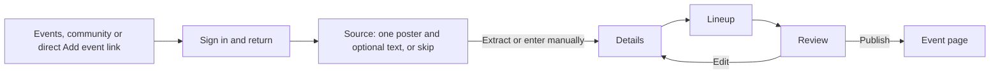

# Single-poster event intake simplification

Status: approved scope on 2026-09-30. Supersedes the multi-image parts of the
[editor redesign plan](2026-09-29-event-editor-redesign.md). Keep PR #356 as the
single delivery changeset.

## Locked decisions

- Source accepts one poster, optional text, or both in the same discovery run.
- The uploaded poster is the artwork. No gallery, ordering, primary selection,
  fallback image, or five-image limit.
- Selecting a new poster replaces the current poster. Removing it clears artwork.
- Removing the only input may leave an existing private draft empty. Keep the
  rejection of newly created empty drafts and existing draft quotas/expiry.
- Preserve manual entry, partial drafts, tentative discovery, dated lineup times,
  stepped contributor/staff/correction editing and existing permissions.
- Keep private source storage and the existing processed public derivative.
- Preserve upload validation, authorized source reads, revision checks, failed
  derivative retry and protection against stale upload completions.
- Remove unshipped plural API/MCP contracts and image-index evidence. Keep the
  existing singular `posterSourceId` and `posterAssetId` contracts. Do not create
  compatibility or migration scaffolding for this unmerged multi-image feature.
- BASIC approved `Maximum 5 images` on 2026-09-30, but the simplified UI removes
  that message. Reuse existing approved copy and short utility labels.

## Task 1: Simplify event intake to one poster

1. Trace singular upload, extraction, save, replacement, removal and publication
   across website, REST, MCP and Convex. Compare the branch against main to remove
   only multi-image additions and retain unrelated fixes.
2. Remove `posterSourceIds`, `posterAssetIds`, their cap/order/normalization logic,
   `posterIndex`, gallery state and primary/fallback selection. Remove other
   multi-image-only interface/state where no longer needed. Keep the already
   public artwork command for singular clients and internal processing.
3. Use one file input and preview. One poster upload automatically prepares
   artwork. Replace/remove invalidate source suggestions and evidence while
   retaining accepted manual fields. Resume, retry, and preview stay functional.
4. Update focused contract, backend, web, MCP and browser tests to cover text
   alone, poster alone, text plus poster, replacement, removal, retry, foreign or
   expired sources and stale/concurrent completion. Remove tests for the removed
   feature rather than preserving dead contracts to satisfy them.
5. Update current backend/API/MCP/authoring and design docs, regenerate OpenAPI,
   and mark the original plan's multi-image scope superseded.
6. Run relevant full backend/web/contract/MCP suites, OpenAPI checks, typechecks
   and lint. Verify desktop/mobile contributor Source and existing stepped
   editor flows. Use Linux Chromium for baseline updates and inspect actual
   screenshots. Record commands, outcomes and limitations in ignored evidence.
7. Commit, obtain independent review, address valid findings, then push to the
   existing PR and complete the exact-head CI/review loop.

## Likely files

Shared contracts and generated OpenAPI; `convex/_eventIntake.ts` and
`convex/eventIntakeSources.ts`; server intake agent and poster storage; discovery
mapping; contributor Source/form/correction filter; contributor Playwright
fixture; focused tests; current intake/backend/developer/authoring/design docs.
Do not change staff canonical media controls, live playback or profile editing.

## Verification focus

A replacement or removal must not let an old completion restore the old poster.
Publication must not use an unrelated or unfinished derivative. Single-poster
source reads must still check actor, draft, ready state and expiry. One discovery
run must combine text and the poster while retaining bounded read-only tools and
unknown/conflicting details. No new abstract source manager is needed.
