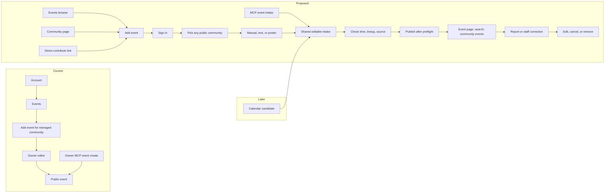

# Community event contribution and AI intake

Status: draft design for BASIC review, 2026-09-25. This incorporates BASIC's decision that a useful contributed event can publish for any community after a reasonable preflight, without prior staff or moderator acceptance. Product implementation, exact public copy, and remaining open choices are not approved by this draft.

Research: [repo survey and approach comparison](../../planning/event-contribution-intake-research-2026-09-25.md), [AI platform findings](../../planning/event-intake-ai-platform-research-2026-09-25.md), [product direction](../../planning/product-direction.md).

## Outcome

An ordinary contributor can find any public community, enter an event manually or extract it from text or a poster, correct the result, and publish immediately. The event is available by URL, in public event search, and on the community's event listing. Website and MCP use one intake contract and the same server publication rules. Community staff and VRDex moderators can promptly correct or remove false or stale entries.

The agent interprets source material. It does not publish, create identities, write promotional copy, or select streams. A poster is extraction input and private evidence, not automatically public artwork. The existing owner/staff event editor and `vrdex_event_create` keep their current authority boundary. Contributor publication is a distinct API/OAuth scope and MCP path.

## Journey

`Add event` is visible even without a managed community. A community page or direct link preselects the target. Authentication returns the contributor to their intake. MCP offers explicit extract/preview and publish tools with idempotent receipts and readback. The public event source is shown in plain metadata without implying owner confirmation. Exact public-facing wording needs BASIC's review.

## Shared intake and agent

Manual, text, and poster inputs converge on a partial `EventIntakeDraft` type. It can hold missing fields, alternate interpretations, ordered untimed lineup names, and tentative person matches. It cannot be the current canonical `EventDraftInput`, which requires a title and timestamp. A complete intake converts to the canonical event contract; incomplete work stays editable in the current client/session. Temporary server storage is justified for poster processing or resumable work, not a mandatory proposal row for every event.

The parser is a short VRDex-owned server loop using a vision-capable model, strict structured output, and a fixed budget of read-only calls. Candidate tools: `search_people`, `search_communities`, and `resolve_local_time`, all returning bounded public data. Time resolution reports zero, one, or multiple valid instants. The model separates directly observed facts, calculations, guesses, conflicts, and unknowns, and can propose lineup order and possible identities. VRDex revalidates every returned ID. A possible match is not silently confirmed.

The extraction output has `event`, `lineup[]`, `evidence[]`, and `questions[]` fields, with explicit nulls for unknown facts. Actor identity, approval state, and publication fields are server-owned. The contributor sees the source and populated fields, edits them, and deliberately invokes publish. Refusal, malformed output, provider failure, or incomplete extraction leave manual entry available. The agent has no mutation tools.

The existing VRDex Time endpoint is beta-gated. Benchmark its internal planner/executor against a model calling deterministic time utilities on a labeled poster set. Choose by measured accuracy, latency, and cost. Neither the model nor the current browser timezone helper may silently pick an instant during a repeated daylight-saving hour.

## Publication and authority

Current recommendation: any signed-in account can contribute for any public community. This follows ordinary profile-contribution friction; verified-email policy remains open. A contributor receives no `manage_events` authority. Existing `events:write` remains owner/staff authoring, while a distinct contribution scope serves web/API/MCP.

Preflight checks actor and target, required event fields, bounded text and safe links, valid local time, account/target quotas, idempotency, duplicate or removed-event fingerprints, and content risk. Exact duplicates return the existing event; near matches are shown before publication rather than silently merged. A contributor cannot set trusted provenance, owner confirmation, private notes, live watch mode, selected streams, or event-media controls. Performer links derive from matched public profiles.

A passing contribution writes a published canonical `events` row, participants/slots, source/audit evidence, and the public search document as one operation. Current event creation already reindexes search on publication. The response returns a canonical URL and receipt. Publication does not wait for a community queue. The source is marked community-submitted. A complete event must have a public community, title, and event date; a source URL or poster strengthens the smell test but is not required for manual entry. Whether a known date without start time can publish as TBA is open. Unknown-date extractions remain drafts.

## Smell test, correction, and removal

The baseline gate is deterministic: account and target limits, source/URL bounds, temporal sanity, duplicate/repost controls, and suppression checks. [OpenAI's moderation endpoint](https://developers.openai.com/api/docs/guides/moderation) classifies defined harmful-content categories, not event spam or factual authenticity. A separate low-cost event-spam classifier is a candidate after shadow-mode evaluation on genuine, duplicate, malicious-link, fabricated, and unusual-format events. Only high-confidence violations should block publication. Uncertain cases can publish with a prompt post-publication review flag. Classifier failure needs an explicit fallback before launch; it must not quietly become a community-approval queue.

Community owners and `manage_events` staff can edit, cancel, or unpublish contributed events immediately. VRDex moderators need a separate audited removal path because current `canUpdateEvent` recognizes only community authority. Visitors need an event-specific report action. Reports do not automatically retract an event. Removal must affect page access, search, community lists, and feeds, and a bounded fingerprint prevents immediate recreation. Contributor correction rights remain open, but cannot confer broad community authority. These capabilities are part of the initial delivery slice because publication is immediate.

## Source handling and operations

The website accepts poster files. MCP local-file clients use a short-lived purpose-bound upload bridge. Do not fetch arbitrary remote poster URLs in the first slice. Validate image type, size, and decoding; keep source material private and time-bounded; expose it only to the contributor and authorized reviewers. A source URL is a citation, not crawl permission. Public poster artwork requires a separate affirmative choice and policy. Review consent, retention, deletion, and provider data controls before production image intake.

Measure parse attempts, publish conversion, preflight blocks, reports, confirmed spam, false positives, false identity matches, latency, tool calls, tokens, and cost per published event. Log IDs and reason classes instead of poster content. Cap model calls and per-account usage, provide an operator kill switch, and keep manual publication available within the chosen abuse policy. Self-hosters bring model credentials for AI features; the manual path works without them.

## Delivery and evidence

Target one cohesive PR: shared intake/API/MCP contract, public entry points, manual path, poster/text agent, immediate publication, correction/report/removal, docs, and visual evidence. Keep the existing owner path functional. If the classifier is not reliable enough, ship deterministic preflight and post-publication moderation with the classifier disabled rather than inventing mandatory approval. Avoid a separate research-only PR.

Verify partial extraction and strict normalization; DST, cross-midnight times, aliases, unlinked performers, malformed URLs, duplicates, retries, and removal; arbitrary-community contribution versus owner edit authority; MCP recovery; model fixtures using consented and adversarial posters; browser flows through public search and direct URLs; and desktop/mobile screenshots with visual review. Extraction accuracy, spam false positives, latency, and cost are separate measures. Automated preview is not live-provider proof.

## Open decisions before implementation planning

1. Publish a known-date event without a start time as `Time TBA`, or retain it as a draft? Current recommendation: publish with explicit TBA; never invent midnight.
2. Is sign-in alone sufficient for public contribution, or must email also be verified? Current recommendation: signed-in account with quotas.
3. May the original contributor directly edit a published event through a limited, rechecked field set until staff intervenes, or must they submit corrections? Current recommendation: limited self-edit with a staff override lock.
4. How long should private poster evidence be kept, and should a contributor be able to publish the supplied poster separately as event artwork?

No exact public-facing explanatory copy is approved in this draft.
