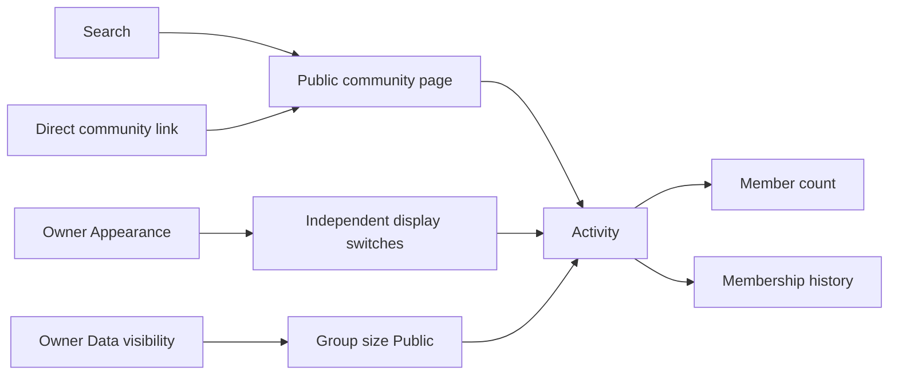

# Public VRChat group membership history

## Goal

A community profile with a primary linked VRChat group can show total group membership over time, even if VRDex has never collected a prior count. This is membership, not instance population. The existing Group size visibility category gates public data. Separately, the profile Appearance editor has independent switches for the current member count and the history graph. Both, either, or neither may appear. These switches affect page presentation, not permissions or API data.

## Current behavior

Connected clubs collect member counts and have a private Total group membership line. When Group size is Public, the public page and API can show the latest count, but no graph. An unconnected community may have a primary VRChat group link without a telemetry integration. VRChat group metadata supplies a creation timestamp and current member count. The worker currently retains the latter but not the former. No member identities are required.

## Data path

Use the primary active VRChat group link as the group identity. Extend the existing authenticated worker group read to validate and retain creation time. Collect count snapshots for linked groups without requiring the worker account to join them. Fetch on link creation or first eligibility, then daily through the existing worker budget and backoff. When the connected collector already reads the same group, reuse that response.

Store one group metadata record and append timestamped count observations on changes or the daily heartbeat. Keep observations permanently. Failed reads leave the last observed count and time intact and never insert zero. Profiles linking the same group share observations, but each applies its own Group size visibility and Appearance switches. Changing the primary link changes the displayed series, without deleting old observations.

Use existing connected-group count observations without migration. The public reader combines them with group-level observations, deduplicates overlaps, and serves bounded time ranges. Long views can use daily samples and a first and latest point; day drill-down can use finer observations. Missing intervals are not represented as measured history.

## Public projection and appearance

Add an optional group-membership projection to the public community profile, usable without a telemetry integration. It contains only a timestamped latest count, group creation time when known, and observed count points. Return it only when Group size is Public. Do not expose group IDs, member identities, collector state, or private coverage detail. Preserve unrelated public telemetry fields and the API schema; suppress legacy connected-group member count and growth when that group differs from the active primary group so they cannot be mistaken for primary-group metrics.

Store optional showMemberCount and showMemberHistory booleans on the existing profile appearance preference. Missing values default to true. The owner edits both on the community Appearance page. Hiding both removes membership content from that page while Group size may remain Public in the API. Private staff and owner analytics are unaffected.

The count card renders only when its switch is on and a count exists. The graph renders only when its switch is on and there is a meaningful endpoint. Observations use a solid line. Group creation is a known one-member baseline, drawn as a distinct diamond with `Group founded` and `1 member` in the tooltip. When the first observation follows creation, a dotted `Unobserved` segment joins those endpoints; it does not imply measured counts between them. The latest actual observation gets a distinct ringed dot and `Today` tooltip with its timestamp only while it is at most 48 hours old. If creation time is unexpectedly missing, render only observed points, without substituting the VRDex profile date.

The staff Home and Analytics membership graphs use the same founding and recent-observation milestones when those timestamps fall in the selected range, including labels in their data tables. A count-growth calculation may use the one-member baseline only for a period that includes group founding. The joins and departures graph continues to use actual membership events and does not invent a founding join. The public count and graph Appearance switches remain independent.

## Page journey

Today Activity shows a latest-count card for eligible connected clubs. The proposed page adds the graph and independent display switches. Secondary linked groups remain links; the primary group supplies this graph.

## Validation and copy

Test connected and unconnected profiles, Group size authorization, all four Appearance combinations, link replacement, duplicate observations, stale provider reads, founding growth, the dotted unobserved interval, and the 48-hour recent marker. Validate the public API contract and private analytics behavior. Inspect desktop and mobile screenshots with a VLM. Locked decision: BASIC approved these exact public labels with this design on 2026-09-29: Group members, Total group membership, Unobserved, Show member count, Show membership graph, Group founded, 1 member, Today, and the observed count with its timestamp.
