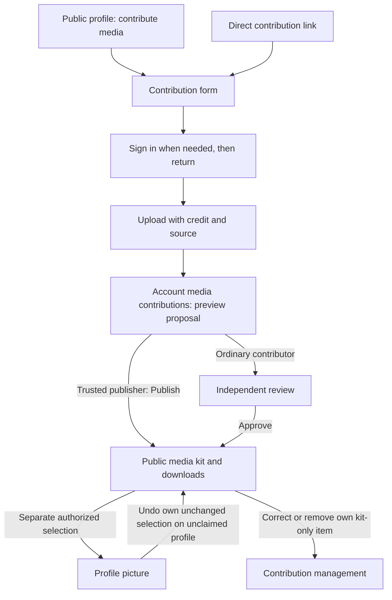
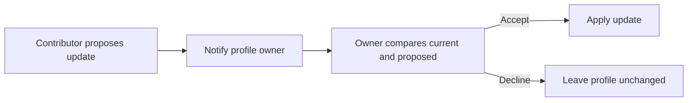

# Media-kit publication and explicit profile-picture placement

## Status and intent

Locked decisions: BASIC approved the product decisions in this chat on
2026-09-30. This written design is awaiting BASIC's review before the
implementation plan. No implementation or production migration is authorized
by the existence of this document.

Make it straightforward for a trusted contributor to upload and publish a
sourced image through either the website or MCP. Publishing an image adds it
to the public media kit. Choosing it as a profile picture is a separate,
deliberate action. Remove the four declarations and the separate evidence
confirmation command from the publishing journey.

## Current experience

Contributor intake requests `profile_image` for a person or `primary_logo` for
a community. Both independent approval and trusted publication apply that
placement when consuming the upload. A primary logo can also become the compact
profile image, so changing a label from picture to logo would not fix the issue.

Trusted publication requires four stored booleans and an empty identity slot.
The website exposes Confirm evidence, Publish, and Independent review as
competing actions. Source URLs appear as raw text. Broad profile `updatedAt`
checks can invalidate a proposal after an unrelated edit; the submitter cannot
use independent review's rebase command on their own proposal.

Existing assets already support multiple placements, additive gallery items,
downloads, attribution, visibility checks, capacity, retention, and cleanup.
Reuse those facilities. A second media-storage system is unnecessary.

The inspected checkout is at `ef6d8f3`, the earlier MCP catalog work. Before
implementation, reconcile this design against current main and current hosted
feature flags. Paths below identify the existing flow, not a release baseline.

## Locked product rules

1. Remove the checklist and Confirm evidence. Do not hide the same checklist
   behind another screen, require those booleans through MCP, or populate them
   automatically as if the publisher made assertions.
2. Upload completion creates a proposal; it does not publish automatically.
   A trusted publisher's explicit Publish action makes their own eligible
   contribution a public media-kit item.
3. Existing profile pictures do not prevent additive kit publication.
4. Ordinary contributors' proposals still require independent review.
   Trusted contributor, trusted publisher, reviewer, owner, and admin authority
   remain distinct. Existing independent-review self-review restrictions remain.
5. Direct trusted publication is limited to public, published, unclaimed
   profiles. Claimed profiles retain their existing owner-management workflow.
6. Owners and authorized admins can change profile pictures. A trusted publisher
   can select their own published kit item into a genuinely empty identity slot
   on an unclaimed profile. Existing pictures require independent review for a
   contributor-requested replacement.
7. A publisher can undo their own selection while that selection remains theirs
   and the profile remains unclaimed. Undoing placement leaves the kit item
   published. An intervening owner, admin, or reviewer selection transfers control of
   that placement, even when it selects the same asset.
8. Contributors can correct metadata or remove their own published kit-only
   items on eligible unclaimed profiles. They cannot use removal to clear an
   image selected by another authorized actor or override claimed-profile control.
9. Keep preview, credit, and a readable source link. Source/sharer credit is
   valid without a claim of artist authorship. For example, Shared by Karly
   must not be rewritten as Created by Karly.
10. Existing restrictions on disputed, rejected, or suppressed material remain.
    Removing assertions does not mean that the service can verify real-world
    permission or authorship automatically. It checks recorded eligibility and
    restrictions and records who performed each action.

## Proposed journeys

Website entry paths include the profile's media contribution action, a direct
contribution link, and account media contributions. Authentication returns the
user to their intended contribution rather than to a disconnected account page.

The publisher card shows the candidate, attribution, source, and publication
destination. A primary Publish action replaces the checklist and confirmation
step. Independent review remains a secondary route; it must not imply a second
upload. Long source URLs become readable links. Public gallery items need a
display title; reuse the existing label and a deterministic fallback without
forcing an additional approval step.

Profile-picture selection lives on the published item, not inside Publish.
The user can leave the asset in the kit indefinitely without choosing a primary
placement. Clearing a selection and removing a kit item are distinct actions.

MCP offers the same sequence: upload, inspect proposal, publish to kit, then
optionally select or clear the primary placement. Corrections and removal must
also be possible through MCP. No browser-only assertion or permission step is
introduced. Existing owner media-management operations remain supported.

## Domain and command design

### Assets and publication

Publish to the existing additive `gallery` placement, preserving metadata and
public media-kit visibility rules. This publication must not create
`profile_image` or `primary_logo`, suppress automatic artwork, or change a
profile's compact identity image. Use existing individual downloads; adding logo
bundles or asset categorization is outside this slice.

Change intake contracts, stored proposal interpretation, publisher commands,
independent approval, public projections, and clients together. Approval of an
ordinary new image also means publication to the kit. An explicit replacement
request must remain distinguishable from an additive image proposal.

Record publication method, actor, resource, inspected version, operation ID,
and receipt. Trusted publication does not invent an independent reviewer.
Preserve historical declaration and reviewer records without presenting them
as a requirement of the new workflow.

### Explicit picture selection

Selecting a published kit asset adds its primary identity placement while
retaining its gallery placement. Replacing or clearing that primary placement
therefore cannot retire the underlying kit item merely because it lost its
identity use. Keep existing media-capacity accounting consistent with one asset
having multiple placements.

Empty-slot eligibility follows current rendering semantics, including authored,
legacy, and visible automatic images. This slice does not turn a visible fallback
image into an empty slot or allow trusted publishers to replace it implicitly.

Record selection actor and a placement revision for new primary actions.
Do not infer who selected legacy placements. Undo checks the exact current
selection, current claim/authority, and expected placement version. An intervening
selection invalidates an older undo request.

A contributor-requested replacement references the already published asset and
uses independent review. Its approval applies the placement change, not a second
asset publication: no re-upload, duplicate blob, or duplicate published charge.
Extend the existing review lifecycle with an explicit placement-change request
rather than treating an already consumed upload as new media. Existing owner
and admin management stays available under its existing authority.

### Metadata correction and removal

Reuse the existing asset-management machinery with bounded contributor
authorization. Check provenance and current state on every command. Permission
to manage a contribution does not grant general profile editing or management
of another contributor's assets.

Version metadata corrections and audit the actor and changed attribution/source.
Do not rewrite historical publication evidence. Removal follows existing logical
retirement, retention, and cleanup; it is not immediate permanent deletion.
Active primary use or protected selection blocks contributor removal. A publisher
may first undo their own eligible placement, then remove their kit-only item.

### Freshness and retries

Use a relevant publication snapshot instead of broad profile `updatedAt` alone.
Bind it to target identity, type, claim and public state, candidate digest and
metadata, and applicable restrictions. Recheck grants, verified email, visibility,
capacity, and authority in the committing transaction. Picture actions additionally
bind the exact placement and its selection revision.

Unrelated biography, tag, or headline edits do not force another upload.
A meaningful change returns a conflict and a fresh inspectable proposal; the
caller can make a new decision against its current version. Do not silently
retry a changed picture selection or a changed identity. Existing stored bytes
remain available through the ordinary proposal lifecycle.

Commands retain actor-scoped durable idempotency keys and receipts. A lost response
is recovered by replaying the same key, not by generating a new operation.
Removing the declaration step must not weaken those guarantees.

### MCP compatibility

Keep the publication tool as the explicit kit-publication command and retain
its expected-version/idempotency contract. Add or reuse bounded placement and
own-contribution management tools with the same server-side authority as the
website. Publishing authority does not grant `assets:write` owner authority or
independent-review scope.

Retire the declaration tool from the advertised workflow. A compatibility handler
can return historical receipts or a terminal retired-command result for old
calls, but new publication never requires declaration. Update catalog fixtures,
OAuth tool/scope mapping, documentation, and hosted clients together. Never
reinterpret an old declaration receipt as a newly approved placement action.

## Existing records and rollout

Pending image contributions become additive kit proposals without losing their
stored candidate, credit, source, contributor identity, or retention state.
Changing proposal intent changes its review version. Old inspected commands
must refuse stale versions; users inspect again without another upload.

Preserve existing deliberately selected primary images. Do not guess that all
legacy placements were deliberate or that all trusted publications were mistakes.
Preserve existing visibility. Already public contribution assets must retain a
kit reference before later primary changes can retire them. Do not make private
owner assets public as a side effect of conversion.

Karly is the explicit correction approved in this design: keep the published
logo, add its kit placement if needed, and clear the automatically assigned
primary placement. A migration dry run must identify the exact current asset and
placement and refuse the correction if another actor has changed that selection
or the target has changed authority. No production action occurs during planning.

Verify the media-kit feature gate and public field visibility before rollout so
Publish cannot report success while the expected kit is unavailable. Preserve
owner privacy settings. Coordinate backend, MCP, and website versions; do not
deploy clients that still require removed declarations or implicitly select
primary placements. Produce a bounded migration report and operation receipts.

## Separate follow-up: proposals to claimed profiles

Locked future direction, outside this implementation:

All contributors, including trusted publishers, need the claimed profile owner's
approval. Store the uploaded candidate and complete proposal so the owner does
not have to upload it again. The owner is the sole proposal reviewer. Do not add
a preliminary reviewer queue in this slice. If screening proves necessary later,
use reviewer authority rather than automatically giving it to trusted contributors.
Notifications, delivery channels, and generalized profile-field proposals belong
to that follow-up design.

## Implementation boundaries and verification

Existing seams: `convex/_profileAssets.ts`, `profileAssets.ts`,
`profileMediaSubmissions.ts`, `_trustedPublication.ts`, `_mediaReview.ts`, the
API contracts, MCP registration/scope map, contribution forms, publication cards,
review UI, and public media-kit rendering. Use the current main versions when
writing the implementation plan.

Deliver one PR with internal phases for backend/contracts, website/MCP, and
migration/hosted verification. Use an implementer and an independent reviewer
for each implementation round. Finish required checks and the existing 30-minute
post-commit review window before declaring a future PR merge-ready.

Acceptance evidence must cover:

- Trusted kit publication without declarations, with an existing profile picture
  untouched, through both website and authenticated MCP.
- Ordinary independent approval producing the same additive kit behavior;
  self-review and claimed-profile direct-publication refusals remain enforced.
- Explicit empty-slot selection, eligible undo, intervening-selection conflict,
  independent replacement, and asset retention after losing primary placement.
- Own-item metadata correction and removal; refusal for another contributor's
  item, protected primary use, revoked authority, or a newly claimed target.
- Unrelated profile edits succeeding without re-upload; changed identity,
  candidate, visibility, claim, restrictions, or placement producing a conflict.
- Durable same-key retry after uncertain publication or placement outcomes.
- Public kit/download rendering, readable source/credit, migration dry runs,
  old-client compatibility, and preservation of historical receipts.

Use targeted backend/contract tests for these boundaries, browser screenshots
with visual review on desktop and mobile, and actual authenticated hosted MCP
tool calls. A catalog listing, OAuth login, local fixture, or backend receipt
alone does not prove the full website/MCP journey. Reuse obvious utility labels
and existing approved copy; submit any substantive new public prose for BASIC's
exact-copy review before shipping.
