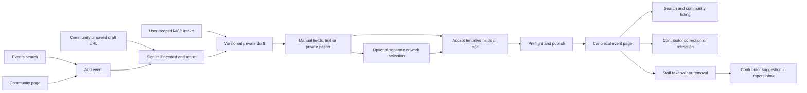

# Contributed event intake checkpoint

Date: 2026-09-28. Scope: Tasks 1 through 9 on
`codex/event-contribution-ai-intake-design`, based on `ca9f361a2` plus the Task 9
verification/docs diff. This is local evidence. Nothing here asserts deployment,
copy approval, hosted accuracy or merge readiness.

## Implemented journey

Any signed-in account can save a partial private draft for any public community,
enter details manually or review text/poster extraction, and publish after
preflight. Unknown dates remain drafts. A date-only event needs an explicit Time
TBA state. Publication returns one idempotent receipt and canonical URL. Website
publication navigates there directly. API/MCP share the contract and server rules.

The owner editor retains its authority and live controls, uses searchable IANA
zones and explicit DST occurrence selection, and labels generated rows Slot N.
One public Lineup includes matched/unmatched and timed/untimed entries. Repeated
sets remain distinct; participant-only duplicates disappear. Performer and
event-level VRCDN/Twitch stream targets share a collapsed, deduplicated DJ links
accordion. Ordinary event links and the contextual watch player remain separate.

## Automated evidence

Commands run in the isolated worktree, without hosted credentials or paid calls:

| Command | Result |
| --- | --- |
| `pnpm test:backend` | 988 passed, zero failed/skipped |
| `pnpm test:web` | 586 passed, zero failed/skipped |
| `pnpm test:api-contracts` | 56 passed, zero failed/skipped |
| `pnpm test:vrdex-mcp` | 10 passed, including local stdio and fake-transport upload |
| `pnpm typecheck:backend` | Passed |
| `pnpm typecheck:web` | Passed |
| `pnpm typecheck:api-contracts` | Passed |
| `pnpm typecheck:vrdex-mcp` | Passed |
| `pnpm lint:web` | Passed |
| `pnpm check:api-openapi` | Passed |
| `pnpm build:docs` | Passed |
| Focused Playwright, desktop/mobile | 54 passed, zero failed/skipped, no baseline updates in final run |
| Public event/watch snapshots, desktop/mobile | 4 passed, zero failed/skipped |

The backend suite exercises real Convex functions in `convex-test`, with local
storage/provider doubles. `event-intake.test.ts` publishes then reads the canonical
event, community listing and discovery index. `event-corrections.test.ts` covers
staff takeover, stale writes, scoped suggestions/reports, removal across public
projections, suppression and restored authority. `event-schedule.test.ts` covers
resumable migration, real public queries, date-only ICS and disabled watch state.
`event-discord-export.test.ts` checks date text without an invented timestamp.
Source tests cover exact actor/draft/source binding, expiry, holds and the pending
artwork cleanup interleaving. These are local transaction and policy proofs.

Task 9 also found event-level stream links outside the DJ accordion. The focused
`tests/web/event-dj-links.test.ts` regression failed before the fix, then passed.
The existing parser now serves both page classification and accordion grouping;
no new component or provider fetch was added. A duplicate Twitch target appears
once across event/performer links, event-only VRCDN remains accessible, and ticket
links stay outside the accordion. The obsolete owner help sentence claiming all
links remain in the normal section was removed; its preceding sentence is unchanged.

## Browser and visual evidence

The guarded Next.js fixture server is local at `127.0.0.1:3019` with
`VRDEX_ENABLE_PLAYWRIGHT_FIXTURES=true` and local Convex URLs. The test command uses
`PLAYWRIGHT_BASE_URL=http://127.0.0.1:3019` and runs these files for desktop Chromium
and Pixel 7 Chromium with one worker:

- `event-contribution.flow.spec.ts`
- `event-intake-source.flow.spec.ts`
- `event-lineup.flow.spec.ts`
- `event-lineup.snapshots.spec.ts`
- `event-editor.snapshots.spec.ts`

Coverage includes manual/text/poster publication navigation, resumed drafts,
explicit candidate acceptance, provider-disabled manual fallback, poster
replacement/preview failures, separate artwork selection, DST gap/fold controls,
stale revisions, community/direct authentication entry, public URL reload,
search/community readback, staff takeover/removal controls and date-only calendar
export/no-player behavior. Staff fixture mutations do not prove backend authority;
backend tests provide that independent evidence.

The publish fixture returns the pre-existing Harbor event URL regardless of its
input. Public search/community readbacks use that fixed server fixture. These
checks prove redirect and readback UI, not persistence of the submitted fields or
authenticated browser-to-Convex publication. Text tests separately assert the
submitted title; canonical write/index consistency is tested in Convex. No
connected hosted end-to-end result is claimed.

Fresh screenshots are saved under `apps/web/test-results/task9-reviewed/`.
Committed baselines live under `apps/web/e2e/__screenshots__/{desktop,mobile}-chromium/`.
The evidence includes owner editor, one public lineup, closed/open DJ links,
manual intake, text/tentative review, private poster/manual fallback, pending
replacement preview and date-only public event. Review requires readable hierarchy,
contained mobile controls, no repeated participant section or per-row URL wall,
visible copy actions after expansion and a date without an invented start time.
Visual review accepted the captures. Desktop uses clear grouped rows; mobile
wraps long stream targets without overflow and keeps copy controls reachable.
Matched portraits, fallback initials, repeated sets and untimed entries remain
readable. Date-only views show the authored date and Time TBA with no player.
Text candidates have explicit Accept actions; source preview and artwork choice
remain distinct. Replacement-pending screenshots show no stale image and a
disabled artwork action. Forms remain long; reducing unrelated profile/edit-page
complexity is outside this slice. The Update elsewhere button is fixture-only.

Both viewport variants were captured. Paths below are relative to `apps/web/`;
replace `{viewport}` with `desktop` or `mobile`.

| Evidence | Path |
| --- | --- |
| Owner editor | `e2e/__screenshots__/{viewport}-chromium/event-lineup-editor.png` |
| Closed public lineup | `e2e/__screenshots__/{viewport}-chromium/event-lineup-roster.png` |
| Expanded DJ links | `e2e/__screenshots__/{viewport}-chromium/event-dj-links-expanded.png` |
| Public event/watch | `e2e/__screenshots__/{viewport}-chromium/event-profile.png`, `event-watch-surface.png` |
| Date-only | `test-results/task9-reviewed/event-contribution.flow-da-6a8ac-rt-and-no-watch-player-flow-{viewport}-chromium/event-date-only.png` |
| Manual intake | `test-results/task9-reviewed/event-contribution.flow-in-ee8f4-has-no-mobile-overflow-flow-{viewport}-chromium/event-intake.png` |
| Tentative text / accepted text | `test-results/task9-reviewed/event-intake-source.flow-t-065dd-ly-and-keeps-questions-flow-{viewport}-chromium/tentative-review.png`, `text-review.png` |
| Private poster / manual fallback | `test-results/task9-reviewed/event-intake-source.flow-p-d4ad6-lback-remains-editable-flow-{viewport}-chromium/poster-private.png`, `poster-manual.png` |
| Pending source replacement | `test-results/task9-reviewed/event-intake-source.flow-r-f62a8-k-before-the-new-image-flow-{viewport}-chromium/replacement-pending.png` |

The corresponding final journey captures are also in `test-results/task9-final-proof/`.
Local test-result folders are ignored artifacts, not public assets or committed
source posters. The owned fictional poster is the only upload fixture.

An initial run failed because the inherited port 3018 server stopped. A fresh
local server resolved that infrastructure failure. The next run exposed a test
selector matching source text containing Time TBA; it now selects the checkbox
by its exact role/name. Older lineup screenshots predated contribution controls
and Slots labeling and required visual review before replacement. These failures
are not counted as passed checks. Added stream/watch selectors were corrected to
assert collapsed DOM content by href and event stream suffix before the final pass.
Existing NO_COLOR/FORCE_COLOR and Next middleware warnings remain; the docs build
reports stale Browserslist data and untracked-file update dates, not broken links.

## Release and operator gates

See [deployment sequence](../deployment/convex-environments.md#event-intake-staged-release-checks)
and [source controls](../backend/event-intake-sources.md).

- Schema/index backfill and both schedule switch states pass locally. No deployed
  migration, index-readiness check or switch change was performed.
- Website actor/session binding, user-scoped `events:contribute`, rejection of
  application-only credentials and unchanged `events:write` authority pass local
  API/MCP/backend tests. Hosted Clerk/Convex and OAuth journeys remain unverified.
- Retention is 30 days after draft activity or the event date, capped at 180 days
  after upload. Specific report holds pause deletion. The ten-minute cleanup
  worker and storage race recovery pass local doubles, not real S3/CORS/delete
  operations. No real poster was uploaded.
- Extraction defaults off; classification defaults off. Manual publication works
  without model credentials. Both have kill switches and share 20 actor attempts
  per rolling day. Extraction allows four turns, three read-only tool calls and
  6,000 output tokens per turn. Classification allows 300 output tokens. There is
  no dedicated global contribution-write kill switch or measured dollar budget.
- Logs bound IDs/reasons, calls, latency and tokens. Cost remains null. The owned
  fictional fixture corpus and injected model responses check schema/tool/DST
  behavior, not model accuracy. Paid field accuracy, identity errors, false-block
  rates, latency and cost per publish are unmeasured. Keep extraction and blocking
  disabled until the consented evaluation and release review are complete.
- Exact copy approval below remains open. Push, PR, deployment, paid calls and
  actual uploads are outside this task. The controller owns final review and any
  authorized delivery. The 30-minute exact-head PR readiness gate still applies.

## Exact public copy for BASIC review

Approval status: pending. Implementation/design authorization is not exact-copy
shipping approval. The lists below consolidate Tasks 1 through 8 and the Task 9
integration check. They exclude pre-existing unchanged copy, fixture prose,
technical protocol errors and source/model-provided evidence/questions. Dynamic
names and times are values, not newly authored claims.

Authored sentences and confirmation prompts:

1. `This local time does not exist.`
2. `Add a community, title and date.`
3. `Choose a time zone and start time, or Time TBA.`
4. `Choose a time zone.`
5. `Check similar events before publishing.`
6. `This draft changed elsewhere. Reload before saving.`
7. `Unable to submit. Try again.`
8. `Retract event?`
9. `Take over this event and close contributor editing?`
10. `Remove event?`
11. `Ambiguous local time requires an earlier or later occurrence.`
12. `Local time does not exist in this timezone.`
13. `Event date must be valid.`
14. `Time zone must be a valid IANA time zone.`
15. `Choose a PNG, JPEG or WebP image up to 12 MB.`

Long phrases, actions and placeholders:

- `City, region or abbreviation`
- `Search communities`
- `Choose occurrence`
- `Add untimed performers`
- `Suggest correction`
- `Proposed correction`
- `Submit correction`
- `Different event`
- `Manage {community display name} event`
- `Use as event artwork`

Utility labels and short states, listed for completeness:

`Time TBA`, `Community-submitted`, `Lineup`, `DJ links`, `Date`, `Venue`,
`World profile`, `Source text`, `Slots`, `Performer`, `Person profile`, `Role`,
`Slot {N}`, `Earlier`, `Later`, `Repeated time`, `Day offset`, `Start time`,
`End time`, `Draft saved`, `Submitted`, `Staff only`, `Event reports`,
`Event unavailable`, `No reports`, `Latest`, `Next`, `Correct event`,
`Retract event`, `Take over`, `Report event`, `Submit report`, `Remove event`,
`Similar events`, `No matches`, `Retracted`, `Extract details`,
`Extraction unavailable`, `Private source`, `Artwork selected`,
`Tentative details`, `Questions`, `Source evidence`, `Poster`, `Accept`,
`Contribute events`, `Event contributions`, `VRCDN`, `Twitch`, `PC`, `Quest`.

Accessibility names include `Event source`, `Source poster`,
`Accept {field label}`, `Time zone`, `Time zones`, `Start occurrence`,
`{field label} occurrence` and `{field label} day offset`. No AI branding is added.
Task 9 groups event-only streams under the event's authored title. It adds no
new public explanatory sentence. The profile-editor proposal has a separate
[copy decision list](../planning/profile-editor-progressive-disclosure-2026-09-28.md)
and is not implemented here.
